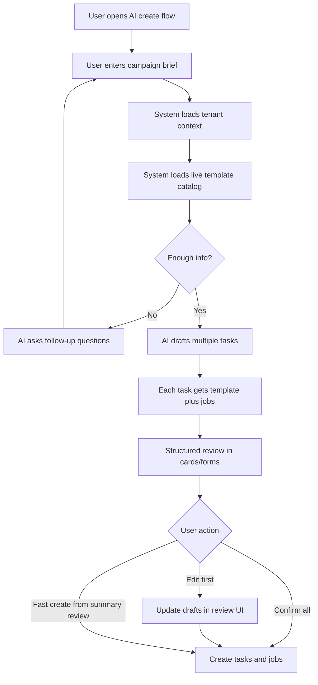

# AI Task And Job Creation

## Problem Frame
Today task authoring depends on an external AI workflow: the user writes prompts elsewhere, gets JSON back, then pastes or edits that JSON through the `From JSON` flow in `frontend/src/components/TaskList.vue`. That works for power use, but it creates friction, splits the workflow across tools, and makes batch campaign creation harder than it should be.

The desired change is an in-product AI creation flow that turns a natural-language brief into one or more draft tasks with draft jobs. The first version should be multi-template ready, should use tenant-aware context, and should feel like native task authoring rather than a hidden JSON-only power feature. Single-task drafting remains in scope, but batch campaign drafting is the primary value target.

The diagram below describes the end-state target flow, not the full scope of Slice 1.

## Requirements

**Authoring Outcome**
- R1. The product must let a user submit a natural-language brief and receive a draft bundle containing one or more tasks, each with its own selected template and draft jobs.
- R2. The AI flow must support batch campaign authoring as a primary use case rather than only a single-task helper.
- R3. The generated output must be treated as drafts for review, not as final content that bypasses user oversight.
- R3a. AI-generated drafts must live in a persisted draft-session artifact until the user confirms creation or explicitly discards the session. The draft session is the persisted container for the current draft bundle.

**Context And Decisioning**
- R4. The AI flow must use the current brief plus an explicit allowlisted subset of tenant-specific context available in the product, including non-secret brand/account description fields that help keep output on-brand.
- R5. The AI flow must consume a live template catalog from a backend-managed source instead of relying on a hardcoded frontend template list, and that catalog must only expose templates that the current product can validly create and run.
- R6. After the AI selects a template for a draft task, the system must provide template-specific guidance for shaping that task's fields and jobs.
- R7. If the initial brief is missing information that blocks a reasonable first draft, the AI must ask follow-up questions before producing tasks/jobs rather than silently inventing missing intent.
- R7a. The clarification experience should preserve conversational history while rendering each AI question as structured inputs whenever possible.

**Review And Creation UX**
- R8. The primary review surface must be structured cards/forms for tasks and jobs, not a raw JSON textarea.
- R9. The review step must allow the user to inspect and edit draft tasks, selected templates, and draft jobs before persistence.
- R10. The flow must default to review-first behavior, while also offering a fast path to create from a summary review when the user does not need per-task or per-job edits.
- R11. The product may expose raw JSON as an optional power-user view, but JSON must not be the primary interaction model for AI creation.
- R11a. When a reviewed batch is confirmed, creation must be all-or-nothing by default: either the entire approved bundle becomes real tasks/jobs, or nothing is created.
- R11b. If all-or-nothing creation fails, the draft session must remain available with structured error details attached so the user can revise and retry.
- R11c. After a failed create attempt, the product may use AI to suggest repairs to the draft session, but those repairs must be reviewed by the user before another creation attempt.

**Scope And Integration Boundaries**
- R12. The first version must be designed for multiple templates from the start rather than being limited to `instagram_post`.
- R13. The feature must create normal `Task` and `Job` records using the existing domain model instead of introducing a parallel AI-only content entity.
- R14. The AI creation flow must stay tenant-scoped and respect the same authenticated tenant context and authorization boundaries as existing task and job creation flows.

## Success Criteria
- A user can create a multi-task campaign draft from a natural-language brief without leaving the product for external AI tools.
- A user can also create a single-task draft through the same AI flow when batch planning is unnecessary.
- The normal happy path for AI creation uses structured review UI rather than manual JSON editing.
- The resulting tasks and jobs are compatible with the existing task detail, job editing, and processing flows.
- Adding or changing templates does not require hardcoding the AI-facing template list in the frontend.
- A failed batch create attempt does not leave behind partial task/job records.

## Scope Boundaries
- The first version does not need to auto-submit created tasks into later workflow states such as approval, processing, or publishing.
- The first version does not need to eliminate the existing `From JSON` feature; it can remain as a power-user fallback.
- The first version does not require long-term memory from prior tasks/jobs beyond whatever tenant-aware context is explicitly chosen for the AI input contract.
- The first version does not send tenant credentials, tokens, or raw integration configuration to the AI model.

## Key Decisions
- Native AI authoring over external JSON workflow: the feature should replace the current external-AI-plus-paste loop for the main use case, not just generate JSON faster.
- Batch-first over single-task-first: the primary user value is campaign drafting that can produce multiple tasks in one run.
- Review-first hybrid flow: users should review/edit drafts by default, with a faster creation shortcut available when the output is already good.
- Ask-first behavior for missing inputs: when the brief is too incomplete, clarification is preferable to hidden assumptions.
- Hybrid clarification UX: the user should see a chat-like history, but answer AI questions through structured fields instead of freeform chat alone.
- Persisted draft sessions: AI authoring should survive refresh and later resumption instead of living only in browser memory.
- Transactional create plus repair suggestions: reviewed bundles should create all-or-nothing, and failed attempts should feed an AI-assisted repair loop that still requires user review.
- Open-ended template catalog: the AI flow should read templates from a backend-managed source so template growth does not require repeated frontend hardcoding, while still limiting AI-visible choices to templates supported by the current runtime.
- Delivery should be phased: planning should treat the full document as the target direction, but execute it as small slices with independent verification rather than as one agent-sized implementation.

## Recommended Delivery Slices

**Slice 1: Review-first single-task draft pilot**
- Covers a narrow subset of R1, R3, R8, R9, R13, and R14.
- User enters a brief in-product, receives one draft task with draft jobs, reviews it in structured UI, edits it, and confirms creation.
- Constrain this slice to one currently supported template and one task per run so the team can validate the review UX without also taking on batch orchestration, persisted sessions, clarification loops, or template-catalog work.
- R3a, R7, R7a, and R11c are explicitly deferred beyond this pilot slice.
- Success signal: users can complete the core "brief -> structured review -> create task/jobs" loop without touching raw JSON.

**Slice 2: Batch bundle review and atomic create**
- Expands Slice 1 toward R1, R2, R10, R11a, and R11b.
- Allow one brief to produce multiple draft tasks in a single review surface, then confirm creation as one approved bundle.
- Keep this slice on the same initial template set as Slice 1 so the new complexity is batch review and all-or-nothing creation, not template expansion at the same time.
- Until Slice 3 lands, any R11b recovery in this slice is same-session recovery with structured errors, not full persisted-session durability across refresh or later resumption.
- Success signal: a reviewed bundle either creates fully or fails without partial task/job persistence.

**Slice 3: Draft session durability**
- Expands toward R3a, R11b, and the "resume later" part of the desired UX.
- Persist draft sessions so users can refresh, resume, discard, and retry after create failures.
- Keep AI behavior unchanged in this slice; the only new user value is durability and recoverability.
- Success signal: draft work survives interruption and failed creates remain editable rather than forcing restart.

**Slice 4: Multi-template catalog and guidance**
- Expands toward R5, R6, and R12.
- Replace the current hardcoded template assumption with a backend-managed catalog and template-specific drafting guidance.
- This should be the point where the feature becomes genuinely multi-template rather than "instagram first with future intent."
- Success signal: adding or changing supported templates no longer requires frontend hardcoding of the AI-visible template list.

**Slice 5: Clarification loop**
- Expands toward R7 and R7a.
- Introduce follow-up questions when the initial brief is not sufficient for a reasonable first draft, while preserving conversational history and structured answers.
- Keep this separate from template-catalog work so the team can evaluate whether clarification actually improves draft quality before layering on more complexity.
- Success signal: incomplete briefs trigger an understandable clarification step instead of low-quality or overly invented drafts.

**Slice 6: AI-assisted repair**
- Expands toward R11c.
- After a failed create attempt, offer suggested repairs to the draft session, but always return those suggestions to structured user review before another create attempt.
- This slice should come last because it depends on meaningful draft persistence and structured error reporting already existing.
- Success signal: users can recover from common create failures with guidance, without the AI silently changing approved intent.

## Dependencies / Assumptions
- Current repo behavior confirms that authenticated tenant-scoped task and job creation already exists through the API, and that the current UI supports manual task creation, manual job creation, and a JSON import path.
- Current repo behavior also confirms that only `instagram_post` is wired today, so multi-template support and a live backend template catalog are part of the new capability rather than already-existing infrastructure.
- Tenant fields such as `name`, `description`, and social/account metadata are available today and can participate in tenant-aware AI context.
- Tenant `env` exists today, but it is a configuration surface that may contain secrets; it is excluded from AI context by default.
- Current repo behavior does not show an existing text-LLM authoring path for natural-language brief -> structured task/job drafts, so Slice 1 includes new model-integration, validation, and failure-handling work rather than only UI work.

## Outstanding Questions

### Deferred to Planning
- [Affects R5][Technical] What backend contract should provide the template catalog and template-specific guidance to the AI flow?
- [Affects R6][Technical] How should template-specific follow-up prompts be represented so the AI can ask for missing template-required details without duplicating business rules in multiple places?
- [Affects R8][Technical] Should the structured review UI live inside `frontend/src/components/TaskList.vue` or be introduced as a separate dedicated creation surface?
- [Affects R11a][Technical] What backend service and transaction boundary should own all-or-nothing creation of a reviewed draft bundle?
- [Affects R4][Needs research] Which tenant fields should be included by default in AI context, and which should remain excluded unless explicitly mapped?
- [Affects R3a][Technical] Where and how should persisted draft sessions be stored, expired, resumed, and discarded?
- [Affects R10][Technical] What should the user see after successful creation, cancellation, or failure short of full bundle success so the flow remains understandable in batch mode without implying partial task/job persistence?
- [Affects R11c][Technical] How should structured create errors be transformed into AI repair suggestions without letting the AI silently override user-approved intent?

## Next Steps
→ `/ce:plan` for structured implementation planning, starting with Slice 1 instead of the full end-state
