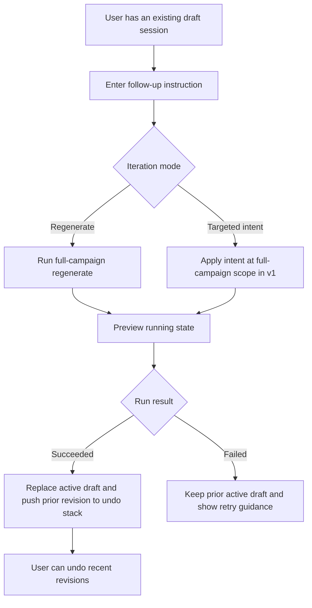

# AI Draft Iterative Instructions

## Problem Frame
Users can generate and inspect AI draft sessions, but follow-up instruction loops are still awkward. They need to refine an existing draft by giving additional direction without losing context, while preserving observability and keeping behavior predictable.

## Requirements

**Iteration Modes**
- R1. The draft modal must support additional instructions on an existing draft session without requiring the user to start a brand-new session.
- R2. The system must support both iteration modes in the same session: (a) full-campaign regenerate with new constraints and (b) targeted edit intent that is explicitly applied at full-campaign scope in v1.
- R3. Each iteration request must remain attached to the same `draft_session_id` and append to session communication history across rounds (no destructive transcript reset between iterations).
- R4. Iteration requests must use an explicit mode + instruction contract so regenerate and targeted-intent runs are unambiguous to users and downstream services.

**Result Handling and Undo**
- R5. On successful run completion, the system immediately replaces the active draft revision in place.
- R6. The system must provide lightweight undo for recent successful revisions, with a deterministic v1 window of up to 3 revisions and at least 1 guaranteed undo step.
- R7. Undo behavior must be explicit and user-visible before confirm/publish actions, including which revision will be restored.

**UX and Validation**
- R8. Users must receive clear instruction guidance and validation feedback when a follow-up instruction is too vague or malformed.
- R9. While an iteration run is in progress, the UI must show explicit state transitions (`idle -> running -> succeeded|failed`) and prevent conflicting concurrent iteration requests on the same session.
- R10. Failures in follow-up runs must preserve the prior successful draft as current and show actionable remediation (retry/edit instruction/discard).

## Success Criteria
- Users can complete at least one regenerate pass and one follow-up refinement pass in a single draft session.
- Users can recover from at least one bad iteration result via undo without restarting.
- Communication logs remain coherent for prompt-engineering/debug use across multiple instruction rounds in the same session.
- Iteration failures do not wipe out the previously successful active draft.

## Scope Boundaries
- No per-item or per-field targeting in v1; targeted intent is accepted but applied at whole-campaign scope.
- No cross-session branching UI in v1 (full version tree/history browser is out of scope).
- No changes to confirm/publish business semantics; this focuses on pre-confirm draft refinement behavior.

## Key Decisions
- Hybrid iteration is the default direction: combine full regenerate + targeted instruction intent in one flow.
- Replace-in-place with lightweight undo is preferred over full version management to control carrying cost.
- v1 targeting depth is whole-campaign only to ship quickly while keeping room for future granularity.
- Iteration event history is append-only per session and grouped by round, not reset on rerun.
- Failure path is non-destructive to the active successful draft.

## Dependencies / Assumptions
- Existing preview status and communication event infrastructure remains the source of truth for iteration progress and traceability.
- Existing cap and session retention behavior continues to apply; iterative edits should not consume additional open-session slots when reusing the same session.

## Outstanding Questions

### Deferred to Planning
- [Affects R6][Technical] What is the lowest-risk storage strategy for lightweight undo snapshots (full bundle copy vs compact diff)?
- [Affects R9][Technical] What dual-layer concurrency guard should be used (API-level check, persistence guard, or both) to avoid race windows?
- [Affects R8][Needs research] What instruction-quality checks are practical without introducing heavy NLP validation complexity?

## Next Steps
-> /ce:plan for structured implementation planning
