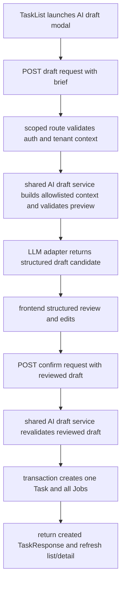

# feat: Slice 1 AI task draft pilot

## Overview

Implement the first shippable slice of AI-assisted task authoring: one authenticated user brief becomes one tenant-scoped draft task with draft jobs, the user reviews and edits that draft in structured UI, and confirm creates normal `Task` and `Job` records. This plan intentionally stops short of batch drafting, persisted draft sessions, clarification loops, repair loops, and multi-template catalog work.

## Problem Frame

The current product supports manual task creation and a JSON import path, but it does not support an in-product "brief -> draft -> review -> create" loop. The origin document defines that full end-state and now explicitly phases delivery. This plan covers only Slice 1 from `docs/brainstorms/2026-04-02-ai-task-job-creation-requirements.md`: prove that structured AI-assisted review is useful without also taking on batch orchestration and long-lived draft-session behavior.

## Requirements Trace

- R1. Accept a natural-language brief and return a draft task with draft jobs.
- R3. Keep AI output in draft/review mode rather than creating final records immediately.
- R4. Use a minimal allowlisted subset of tenant context, excluding secrets and `Tenant.env`.
- R8. Make structured review the primary interaction model.
- R9. Allow the user to edit the draft task and draft jobs before persistence.
- R13. Persist confirmed drafts as normal `Task` and `Job` records.
- R14. Keep all draft and create behavior behind existing authenticated tenant-scoped backend patterns.
- Success criteria: structured review replaces JSON as the happy path for this slice, and created records remain compatible with existing task detail, job editing, and downstream processing flows.

## Scope Boundaries

- Single template only: `instagram_post` is pinned server-side for Slice 1.
- One draft task per brief; no multi-task campaign bundles yet.
- No persisted draft-session artifact; draft state lives only in the active browser session until confirm or cancel.
- No follow-up clarification loop; incomplete briefs may fail or produce thin drafts that the user must edit manually.
- No AI-assisted repair loop after confirm failures.
- No live template catalog; reuse current template knowledge as an interim constraint.

## Context & Research

### Relevant Code and Patterns

- `app/api/routes.py` currently owns manual task and job creation plus template JSON generation. The plan should thin routes further, not add more workflow branching there.
- `app/api/schemas.py` is the existing request/response boundary and should remain the source of truth for API payload shape.
- `app/api/tenant_deps.py` and `app/context.py` already enforce authenticated tenant scoping through `X-Tenant-Id`.
- `app/services/task_repo.py` is the nearest existing persistence seam for task lifecycle work.
- `frontend/src/services/api.js` is the single frontend HTTP integration layer.
- `frontend/src/components/TaskList.vue` is the current entrypoint for manual create and JSON import.
- `frontend/src/components/TaskDetail.vue` already contains structured task/job editing patterns that the draft review UI can mirror instead of inventing a new editing model.
- `docs/architecture.md` and `docs/decisions/001-shared-application-workflows.md` push new multi-step flows toward shared application services instead of route-owned orchestration.
- `docs/decisions/003-explicit-tenant-config-resolution.md` pushes new tenant-aware flows toward explicit config/context objects rather than `os.environ` mutation.
- `docs/deployment-hetzner-flow-mentoverse.md` documents the current hot-swap dev runtime using `mvpipeline-api.service` and `mvpipeline-frontend-dev.service`; Slice 1 manual verification should assume that service topology unless the task explicitly uses another environment.

### Institutional Learnings

- No relevant `docs/solutions/` learnings are present in this repo today.

### External References

- FastAPI dependency and error-handling guidance: [FastAPI dependencies](https://fastapi.tiangolo.com/tutorial/dependencies/), [FastAPI error handling](https://fastapi.tiangolo.com/tutorial/handling-errors/), [FastAPI dependency overrides for tests](https://fastapi.tiangolo.com/advanced/testing-dependencies/).
- Pydantic validation guidance for structured JSON parsing: [Pydantic JSON concepts](https://docs.pydantic.dev/latest/concepts/json/) and [validation errors](https://docs.pydantic.dev/latest/errors/validation_errors/).
- Structured-output caution for LLMs: [OpenAI structured outputs guide](https://platform.openai.com/docs/guides/structured-outputs).

## Key Technical Decisions

- Use a shared backend application service for the draft workflow: route handlers authenticate, validate, and call the service; the service owns LLM invocation, output validation, and confirm-time orchestration.
- Split the user flow into preview and confirm phases: one endpoint returns a validated draft DTO without writing to the database, and a second endpoint confirms the reviewed draft into persisted records.
- Make confirm atomic even in Slice 1: creating one reviewed task plus its jobs should happen in one backend transaction so the pilot does not reproduce the partial-create behavior of the current JSON import loop.
- Pin the template to `instagram_post` in Slice 1: the model should not "choose" templates yet, and the backend should treat the template as fixed until the later multi-template catalog slice from the origin roadmap.
- Use a minimal explicit tenant context allowlist for drafting: `Tenant.name`, `Tenant.description`, `Tenant.instagram_account`, and `Tenant.facebook_page` when present; never send `Tenant.env`, tokens, or raw integration configuration.
- Keep draft state client-held only for this slice: refresh, logout, or tenant switch discards the draft rather than introducing a partial persistence model that conflicts with deferred persisted draft-session work from origin R3a.
- Return stable draft errors rather than raw provider failures: distinguish refusal/validation/integration failure classes without exposing raw upstream payloads or secrets.
- Bind all persistence to server-side tenant context only: preview and confirm payloads must not accept or trust tenant identifiers from the client, and created rows always derive `tenant_id` from `current_tenant()`.
- Reuse the same authorization surface as manual task creation for the pilot, and add conservative request-size and rate-limit safeguards on preview/confirm endpoints to limit LLM spend and oversized payload abuse.
- Do not log full prompts or full model responses in production; any temporary diagnostics must be redacted and explicitly gated.

## Open Questions

### Resolved During Planning

- Should Slice 1 use the existing task-then-jobs create loop? No. Confirm should call a backend workflow that writes one task plus all reviewed jobs atomically.
- Should the AI pick the template in Slice 1? No. The backend pins `instagram_post` and validates the draft against that single template shape.
- What tenant fields should be in the Slice 1 prompt context? A small allowlist of descriptive brand/account fields only: `name`, `description`, `instagram_account`, and `facebook_page`.
- Should Slice 1 reuse `TaskList.vue` or create a separate frontend surface? Use a dedicated child component mounted from `TaskList.vue` so the existing list does not absorb all draft-review state directly.

### Deferred to Implementation

- The exact prompt text, model identifier, and timeout numbers should be chosen during implementation once the LLM adapter is added to `app/config.py`.
- Frontend automated component tests are optional for Slice 1 because the repo does not currently include a Vue test runner; backend automated coverage plus explicit manual UI verification are the baseline.
- Manual UI and runtime verification should use the documented hot-swap services by default: `mvpipeline-api.service` for backend changes and `mvpipeline-frontend-dev.service` for frontend changes.
- Final naming of the new backend service module can stay flexible as long as it remains a shared application workflow entrypoint and not route-owned logic.

## High-Level Technical Design

> *This illustrates the intended approach and is directional guidance for review, not implementation specification. The implementing agent should treat it as context, not code to reproduce.*

## Implementation Units

- [ ] **Unit 1: Bootstrap backend test harness and add draft-preview service**

**Goal:** Add a tenant-scoped backend entrypoint that turns a brief into one validated draft task plus draft jobs without persisting anything.

**Requirements:** R1, R3, R4, R14

**Dependencies:** None

**Files:**
- Create: `app/services/ai_task_draft_service.py`
- Create: `app/services/integrations/llm_text_adapter.py`
- Modify: `app/api/schemas.py`
- Modify: `app/api/routes.py`
- Modify: `app/config.py`
- Modify: `requirements.txt`
- Create: `tests/conftest.py`
- Test: `tests/services/test_ai_task_draft_service.py`
- Test: `tests/api/test_ai_task_draft_routes.py`

**Approach:**
- Bootstrap the minimum backend test harness up front so the service and route work can actually be implemented test-first in this repo.
- Define request/response schemas for a Slice 1 draft request and draft response rather than reusing raw `TaskCreate` or `JobCreate` directly.
- Keep the new route on the existing authenticated tenant-scoped router, but make it a thin delivery adapter that passes `current_tenant()` into the shared draft service.
- Build a small tenant-context DTO inside the service from the allowlisted fields chosen during planning.
- Put external LLM HTTP behavior behind a dedicated adapter so retries, timeouts, and provider-specific response parsing do not leak into routes or core workflow logic.
- Enforce manual-create authorization parity, request-size caps, and rate-limiting hooks at the HTTP boundary before invoking the LLM path.
- Validate provider output in two passes: draft-schema validation first, then Slice 1 domain checks such as one task only, allowed template only, allowed job shape only.
- Return stable error classes for refusal, unusable structured output, and upstream integration failure; do not surface raw provider payloads or secrets.

**Execution note:** Implement new backend behavior test-first at the service seam, then cover the thin route contract.

**Patterns to follow:**
- `app/api/tenant_deps.py`
- `app/context.py`
- `app/api/schemas.py`
- `docs/decisions/001-shared-application-workflows.md`
- `docs/decisions/003-explicit-tenant-config-resolution.md`

**Test scenarios:**
- Happy path: authenticated request with tenant context and a valid brief returns one draft task with one or more draft jobs and no DB writes.
- Edge case: tenant optional fields are absent; the service still builds a valid minimal context and returns a draft or a stable user-facing error.
- Edge case: provider returns a draft for a template other than `instagram_post`; validation rejects it.
- Error path: provider returns malformed JSON or schema-incompatible data; the API returns a stable draft-validation error without leaking raw model output.
- Error path: provider times out or returns 5xx; the route translates that into a stable upstream failure response.
- Integration: route requires auth plus tenant context and rejects missing or mismatched tenant scope consistently with other scoped routes.
- Integration: preview ignores or rejects any tenant-like fields in the request body and always uses server-derived tenant context.

**Verification:**
- The new draft endpoint can be exercised independently of create/confirm.
- No `Task` or `Job` rows are persisted during preview generation.
- Logs and responses avoid secrets, tokens, and raw provider payloads.

- [ ] **Unit 2: Add atomic confirm workflow for reviewed drafts**

**Goal:** Turn a reviewed Slice 1 draft into one real `Task` plus its reviewed `Job` rows in a single backend transaction.

**Requirements:** R3, R8, R9, R13, R14

**Dependencies:** Unit 1

**Files:**
- Modify: `app/services/ai_task_draft_service.py`
- Modify: `app/services/task_repo.py`
- Modify: `app/api/schemas.py`
- Modify: `app/api/routes.py`
- Test: `tests/services/test_ai_task_confirm_service.py`
- Test: `tests/api/test_ai_task_confirm_routes.py`

**Approach:**
- Reuse the reviewed draft DTO from Unit 1 as the confirm payload so the frontend and backend share one reviewed-draft contract.
- Add a confirm entrypoint on the shared service that re-validates the reviewed draft before any persistence.
- Move task-plus-jobs persistence behind one transaction boundary owned by the backend workflow, not the route and not the frontend loop.
- Add a dedicated transactional persistence helper, such as a `task_repo` entrypoint or service-owned session flow, instead of reusing existing per-record save/commit behavior that cannot satisfy atomicity.
- Reuse current task-template hydration behavior for `instagram_post`, but avoid expanding legacy task fields beyond what the existing task/job runtime actually needs.
- Keep created records fully compatible with current list/detail/process flows by persisting ordinary `Task` and `Job` rows with existing statuses (`Task.draft`, `Job.new`).
- Translate any persistence failure into an all-or-nothing failure for the single reviewed draft.
- Derive `tenant_id` only from server-side context during confirm and ignore or reject any client-supplied tenant fields in the reviewed draft payload.

**Execution note:** Start with a failing integration-style service test that proves rollback on mid-create failure.

**Patterns to follow:**
- `app/api/routes.py` task and job create behavior
- `app/services/task_repo.py`
- `docs/architecture.md`
- `docs/decisions/001-shared-application-workflows.md`

**Test scenarios:**
- Happy path: reviewed draft confirm creates exactly one `Task` and the full reviewed job set, all scoped to the current tenant.
- Edge case: user edits task/post fields before confirm; those edits persist exactly as reviewed.
- Edge case: user edits job order/purpose/prompt before confirm; confirmed jobs match the reviewed payload.
- Error path: one job payload is invalid during confirm; the workflow creates no task and no jobs.
- Error path: repository/session failure occurs after task creation but before the final job insert; the transaction rolls back and leaves no partial records.
- Integration: returned `TaskResponse` remains loadable by the existing task detail flow with child jobs intact.
- Integration: confirm cannot be used to persist records into another tenant, even if the reviewed payload is tampered with client-side.

**Verification:**
- Confirm never produces a task without its intended reviewed jobs.
- The existing task list and task detail screens can load the created record without special-case AI handling.

- [ ] **Unit 3: Add frontend brief entry and structured review flow**

**Goal:** Replace the JSON-first path for this slice with an in-product brief form, loading state, structured review editor, and confirm/cancel behavior.

**Requirements:** R1, R3, R8, R9

**Dependencies:** Unit 1, Unit 2

**Files:**
- Create: `frontend/src/components/AiTaskDraftModal.vue`
- Modify: `frontend/src/components/TaskList.vue`
- Modify: `frontend/src/services/api.js`
- Modify: `frontend/src/style.css`

**Approach:**
- Add a distinct "AI Create" entrypoint from `TaskList.vue` rather than repurposing the JSON modal.
- Keep the draft in component state only for Slice 1, and make the draft loss behavior explicit on cancel, refresh, auth loss, or tenant switch.
- Use the backend draft endpoint for preview, then render task/job fields in structured controls that mirror existing task/job editing patterns instead of inventing a JSON editor.
- Show a full-modal busy state during preview, disable repeated preview submits, and define retry actions clearly: retry reuses the same brief, edit returns to the brief form, dismiss clears the current draft state.
- Disable confirm while the confirm request is in flight so double-submit does not create duplicate tasks.
- Do not allow the modal to close silently during confirm; either block close or defer it until the response resolves so late responses cannot repopulate stale UI.
- On success, refresh the task list and select/open the new task through the existing list/detail workflow; if refresh or selection fails after a successful confirm, show an explicit success message with the new task id so the user can recover.
- Surface a clear warning when tenant change or auth loss discards the in-memory draft.
- Keep raw JSON out of the primary flow; if engineers decide to surface it at all, it remains secondary and read-only for this slice.

**Execution note:** Prioritize backend automated coverage for Slice 1. Frontend verification may remain manual in this slice unless the repo already grows a minimal Vue test runner for unrelated reasons. When running manual checks, use the hot-swap services rather than starting duplicate ad hoc API or Vite dev servers.

**Patterns to follow:**
- `frontend/src/components/TaskList.vue`
- `frontend/src/components/TaskDetail.vue`
- `frontend/src/services/api.js`

**Test scenarios:**
- Happy path: user enters a brief, receives a draft, edits task/job fields, confirms, and the created task appears in the refreshed list.
- Edge case: user cancels after a draft is loaded; no persistence occurs and the local draft is cleared.
- Edge case: tenant changes while a draft is open; the draft is discarded and the user cannot confirm against the wrong tenant.
- Error path: draft generation fails; the modal shows a stable error state with retry or dismiss behavior.
- Error path: confirm fails; the draft remains editable in the current session and the error is visible without losing the reviewed edits.
- Integration: a `401` during preview or confirm clears auth through the existing interceptor path and the draft UI exits cleanly.
- Integration: closing or tenant-switching during preview does not let late responses reopen or overwrite dismissed draft state.

**Verification:**
- The happy path no longer depends on manual JSON editing.
- Slice 1 draft UX remains understandable even when preview or confirm fails.
- Frontend validation assumes `mvpipeline-frontend-dev.service` is the active Vite runtime for manual testing.

- [ ] **Unit 4: Update runtime and architecture documentation**

**Goal:** Document the new Slice 1 runtime path and make backend verification repeatable for future slices.

**Requirements:** Supports the origin document's runtime and architecture direction; no new product behavior.

**Dependencies:** Unit 1, Unit 2, Unit 3

**Files:**
- Modify: `docs/runtime-flows.md`
- Modify: `docs/architecture.md`

**Approach:**
- Update runtime documentation so the AI draft preview/confirm flow is reflected alongside existing manual create and JSON import paths.
- Update architecture docs only where needed to point to the new shared workflow entrypoint as another example of delivery -> application movement.
- Add Slice 1 validation notes that point implementers to the hot-swap service topology for API/frontend restarts and health checks rather than generic local dev server commands.

**Patterns to follow:**
- `docs/runtime-flows.md`
- `docs/architecture.md`
- `.cursor/rules/03-testing.mdc`

**Test scenarios:**
- Test expectation: none -- this unit is documentation-only and should not introduce new runtime behavior.

**Verification:**
- The repo has a repeatable backend test seam for Slice 1.
- Architecture and runtime docs describe the new flow accurately without overstating deferred slices.
- Runtime verification guidance for Slice 1 aligns with `mvpipeline-api.service` and `mvpipeline-frontend-dev.service`.

## System-Wide Impact

- **Interaction graph:** `frontend/src/components/TaskList.vue` and `frontend/src/components/AiTaskDraftModal.vue` call new `frontend/src/services/api.js` methods, which call new draft/confirm HTTP routes, which call a shared backend draft workflow service and a narrow LLM adapter plus task persistence helpers.
- **Error propagation:** preview-time LLM errors and validation failures stop at the draft boundary; confirm-time persistence errors stop at the confirm boundary; neither path should leak secrets or raw provider payloads.
- **State lifecycle risks:** in-memory draft loss on refresh/logout/tenant switch is accepted for Slice 1 and must be explicit in UX copy; confirm-time partial writes are not accepted and are mitigated by the transactional create workflow.
- **API surface parity:** no worker, scheduler, publish, or CLI paths change in Slice 1; only the authenticated tenant-scoped HTTP API grows.
- **Integration coverage:** route tests plus service tests should prove tenant scoping, preview validation, error translation, and atomic confirm without requiring end-to-end worker/publish execution.
- **Unchanged invariants:** created tasks remain ordinary `Task` rows, created jobs remain ordinary `Job` rows, downstream processing/publish semantics stay unchanged, and `Tenant.env` remains excluded from AI context.

## Risks & Dependencies

| Risk | Mitigation |
|------|------------|
| The repo has no existing text-LLM authoring seam, so preview work is underestimated | Keep the new adapter small, isolate it behind one service boundary, and cover the contract with service tests before UI work expands |
| Adding frontend automated tests may over-scope Slice 1 | Treat backend service and route coverage as mandatory; keep frontend automated coverage opportunistic and use manual verification if the harness cost is disproportionate |
| In-memory-only drafts may confuse users who expect resume behavior | Label Slice 1 as a pilot flow, clear drafts predictably on auth/tenant loss, and keep R3a explicitly deferred to a later slice |
| Current route file is already large | Add thin routes only and move all new branching into the shared service so the slice improves boundaries locally instead of worsening them |
| Upstream LLM failures could expose noisy or unsafe errors | Normalize failures into stable preview errors, use explicit timeouts, and avoid logging raw prompts/responses by default |
| Manual verification could accidentally use stale or duplicate dev servers | Treat `mvpipeline-api.service` and `mvpipeline-frontend-dev.service` as the default verification runtime, and restart/check only the affected hot-swap services when runtime validation is needed |

## Documentation / Operational Notes

- Add explicit config entries in `app/config.py` for the chosen text-LLM endpoint/model/timeout values; do not hardcode secrets.
- Document that Slice 1 uses a fixed `instagram_post` template and a minimal tenant-context allowlist.
- Update runtime docs to mark clarification, persisted sessions, batch drafting, multi-template catalog work, and repair flows as deferred slices rather than missing behavior.
- When Slice 1 touches backend runtime behavior, frontend runtime behavior, or dependency installation, validation should include the relevant hot-swap service restart/status checks using `mvpipeline-api.service` and `mvpipeline-frontend-dev.service`.

## Sources & References

- **Origin document:** [`docs/brainstorms/2026-04-02-ai-task-job-creation-requirements.md`](docs/brainstorms/2026-04-02-ai-task-job-creation-requirements.md)
- Related code: `app/api/routes.py`, `app/api/schemas.py`, `app/api/tenant_deps.py`, `app/context.py`, `app/services/task_repo.py`, `frontend/src/components/TaskList.vue`, `frontend/src/components/TaskDetail.vue`, `frontend/src/services/api.js`
- Related docs: `docs/architecture.md`, `docs/runtime-flows.md`, `docs/deployment-hetzner-flow-mentoverse.md`, `docs/decisions/001-shared-application-workflows.md`, `docs/decisions/003-explicit-tenant-config-resolution.md`
- External docs: [FastAPI dependencies](https://fastapi.tiangolo.com/tutorial/dependencies/), [FastAPI error handling](https://fastapi.tiangolo.com/tutorial/handling-errors/), [FastAPI dependency overrides for tests](https://fastapi.tiangolo.com/advanced/testing-dependencies/), [Pydantic JSON concepts](https://docs.pydantic.dev/latest/concepts/json/), [OpenAI structured outputs guide](https://platform.openai.com/docs/guides/structured-outputs)
