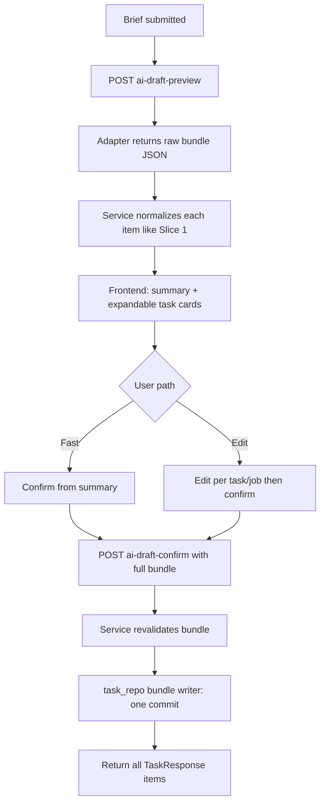

# feat: Slice 2 AI task draft — batch review and atomic create

## Overview

Extend the Slice 1 AI drafting flow so one natural-language brief can produce **multiple** draft tasks (each with its own jobs), reviewed together in one structured surface, then **confirmed once** so that either **all** tasks and jobs persist or **none** do. This slice intentionally keeps the same template constraint as Slice 1 (`instagram_post` only), stays **client-held** for draft state (no cross-refresh durability — see origin Slice 2 notes), and does **not** add clarification loops, persisted draft sessions, multi-template catalogs, or AI repair (R3a, R7, R7a, R11c remain deferred).

## Problem Frame

Slice 1 proved structured review and atomic create for a **single** task bundle. Campaign authoring (origin R2) needs a **batch** review step and **bundle-level** creation semantics (R11a, R11b subset) without yet taking on draft-session persistence (Slice 3) or template expansion (Slice 4). (see origin: `docs/brainstorms/2026-04-02-ai-task-job-creation-requirements.md`)

## Requirements Trace

- R1. Brief produces draft bundle with **one or more** tasks, each with jobs (batch expansion of Slice 1).
- R2. Batch / campaign authoring is a **primary** use case for this slice (multi-task in one run).
- R10. **Review-first** with a **fast path**: user can confirm from a **summary** view when per-task edits are unnecessary.
- R11a. Confirmed create is **all-or-nothing** by default for the approved bundle.
- R11b (Slice 2 scope). On failure, **same-session** recovery: structured error detail, user can revise in UI and retry **without** implying cross-refresh or persisted draft-session recovery (full R11b durability waits for Slice 3 — see origin Slice 2).
- R3, R8, R9, R13, R14. Carry forward from Slice 1: drafts before persistence, structured review/editing, normal `Task` / `Job` rows, tenant-scoped authenticated API.

## Scope Boundaries

- **Templates:** Still **only** `instagram_post`, pinned and validated like Slice 1 (origin Slice 2).
- **Durability:** Draft bundle remains **in-memory** (browser session) only; refresh / logout / tenant switch discards work — explicit UX parity with Slice 1, with copy updated for multi-task loss.
- **No** persisted draft-session artifact (R3a → Slice 3).
- **No** clarification or repair loops (R7, R7a, R11c → later slices).
- **No** live template catalog (R5, R6, R12 → Slice 4).

## Context & Research

### Relevant Code and Patterns

- `app/services/ai_task_draft_service.py` — preview via `generate_preview` / `generate_single_task_draft`; confirm via `confirm_preview` + `_normalize_preview` for one `AiTaskDraftResponse`.
- `app/services/task_repo.py` — `create_task_with_jobs` is one `Task` + `Job` rows in **one** `Session` commit; Slice 2 needs an analogous **bundle** writer, not a per-task commit loop.
- `app/services/integrations/llm_text_adapter.py` — single-task system prompt and `generate_single_task_draft`.
- `app/api/schemas.py` — `AiTaskDraftRequest`, `AiTaskDraftResponse`, `AiTaskDraftConfirmRequest`.
- `app/api/routes.py` — `POST /tasks/ai-draft-preview`, `POST /tasks/ai-draft-confirm` returning `AiTaskDraftResponse` / `TaskResponse`.
- `frontend/src/components/AiTaskDraftModal.vue`, `frontend/src/services/api.js` — single-task contract and UX.
- `tests/services/test_ai_task_draft_service.py`, `tests/api/test_ai_task_draft_routes.py` — patterns for service-first and route contract tests.
- Architecture direction: `docs/decisions/001-shared-application-workflows.md`, `docs/decisions/003-explicit-tenant-config-resolution.md`, `.cursor/rules/02-architecture-constraints.mdc` — keep orchestration in the shared service; thin routes.

### Institutional Learnings

- No `docs/solutions/` content in this repo today.

### External References

- None required for planning: Slice 1 establishes FastAPI + Pydantic + transactional patterns; batch work extends them locally.

## Key Technical Decisions

- **Unified bundle contract:** Evolve preview and confirm to a **bundle** DTO (ordered list of `{ task, jobs, warnings? }` per item) so the **degenerate case** is one item — one code path for single-task and multi-task. This is a **breaking HTTP contract change** coordinated with the Vue client in the same work; document for any non-repo API consumers.
- **Single persistence boundary:** Add a dedicated repository (or service-owned) entrypoint that persists **all** tasks and their jobs in **one transaction** (one session, one commit). Never implement bundle confirm as repeated `create_task_with_jobs` calls without a wrapping transaction.
- **Adapter boundary:** Extend the text adapter with a **campaign-oriented** method (directional name e.g. generate multi-task draft) that returnsJSON matching the bundle schema; enforce a **server-side maximum item count** (config-driven) to cap cost and prompt size.
- **Structured confirm / validation errors:** For R11b same-session recovery, confirm failures that reflect user-editable issues should return **machine-readable** error payloads (e.g. item index + field + message) in addition to a human summary — avoid only an opaque string `detail` for validation-class failures. Exact JSON shape is deferred to implementation; the plan requires the **category** of structured client-usable errors.
- **Success response:** Return **all** created tasks in confirm response (e.g. `list[TaskResponse]` wrapped in a named field) ordered consistently with the bundle so the UI can refresh the list and optionally focus the first or show a count — resolves origin “after success in batch mode” (Deferred to Planning list) for this slice.
- **Ordering invariant:** Persist and return created tasks in the **same order** as bundle items so tests, support, and UX (e.g. “first task in review is first in response”) stay predictable.
- **Idempotency:** Slice 2 **does not** introduce an idempotency-key protocol; mitigations are strong client-side confirm disabling and documenting **duplicate-bundle risk** if the user retries after an ambiguous network outcome. Revisit if duplicate creates become a reported problem.
- **Tenant and secrets:** Unchanged from Slice 1 — server-derived `tenant_id` only; same tenant context allowlist; no `Tenant.env` or credentials in LLM input.
- **Logging:** Unchanged — no full prompts/responses in production logs.

### Resolved During Planning

- **R11b in Slice 2:** Same-session only; structured errors and editable draft in memory; no requirement that failed create survives refresh (origin Slice 2).
- **Template breadth:** Same as Slice 1 — `instagram_post` only.

### Deferred to Implementation

- Exact max bundle size default, prompt wording for multi-task output, and timeout values.
- Precise Pydantic models and OpenAPI field names for bundle and structured errors.
- Whether to use `422` vs `400` consistently for validation vs domain errors (follow existing route conventions after audit).

## High-Level Technical Design

> *This illustrates the intended approach and is directional guidance for review, not implementation specification. The implementing agent should treat it as context, not code to reproduce.*

## Implementation Units

- [x] **Unit 1: Bundle schemas and multi-item preview normalization**

**Goal:** Define API types for an ordered list of draft items; extend `AiTaskDraftService` and tests so preview validates **N ≥ 1** items, each enforced as `instagram_post` with non-empty jobs and template merge behavior **per item** (reuse current `_normalize_preview` logic in a loop or extracted helper).

**Requirements:** R1, R2, R14

**Dependencies:** None

**Files:**
- Modify: `app/api/schemas.py`
- Modify: `app/services/ai_task_draft_service.py`
- Modify: `app/services/integrations/llm_text_adapter.py`
- Modify: `app/api/routes.py` (preview handler wiring only if shape changes)
- Test: `tests/services/test_ai_task_draft_service.py`
- Test: `tests/api/test_ai_task_draft_routes.py`

**Approach:**
- Introduce bundle request/response models; keep field naming consistent with existing `AiTaskDraft*` types where possible.
- Replace or wrap `generate_single_task_draft` with a bundle-capable adapter method; stub/tests use dict payloads or fakes without live HTTP.
- Enforce configured max items; reject oversize or empty bundles with stable validation errors.
- Preserve rate limiting / request size behavior from Slice 1 on the preview route.

**Patterns to follow:**
- Slice 1 validation rules in `ai_task_draft_service.py` (`InstagramPost` merge, job ordering).

**Test scenarios:**
- **Happy path:** Preview with brief returns bundle of **one** item — equivalent to Slice 1 shape after migration.
- **Happy path:** Preview returns **N > 1** items, each valid template and jobs.
- **Edge case:** **N = 0** or above max items rejected with stable error.
- **Edge case:** One item has wrong template or zero jobs — preview validation fails with identifiable failure (item index if applicable).
- **Error path:** Malformed provider JSON — same stable error class as Slice 1.
- **Integration:** Preview route still requires auth + tenant header semantics unchanged.

**Verification:**
- Service tests cover normalization for multi-item bundles without DB writes.

- [x] **Unit 2: Transactional bundle persistence**

**Goal:** Add a single repository-level operation that creates **multiple** tasks and **all** their jobs in **one** transaction; wire `AiTaskDraftService` confirm to accept the reviewed bundle and call this writer; on **any** failure, **no** tasks or jobs from that bundle remain.

**Requirements:** R11a, R13, R14

**Dependencies:** Unit 1

**Files:**
- Modify: `app/services/task_repo.py`
- Modify: `app/services/ai_task_draft_service.py`
- Test: `tests/services/test_ai_task_draft_service.py` (new confirm-bundle cases; inject failing writer)

**Approach:**
- Build `Task` / `Job` ORM objects per bundle item with `tenant_id` from server context only; assign jobs to tasks before insert (same pattern as single-task: add task, add jobs with `task_id` after flush or rely on ORM relationship — match existing `create_task_with_jobs` relationship behavior).
- Add service method e.g. confirm bundle that validates each item then calls the new writer.
- Inject a failing writer in tests to prove **rollback leaves zero new rows** for the bundle attempt.

**Execution note:** Add a failing-writer test **before** relying on production writer behavior (characterization of atomicity).

**Patterns to follow:**
- `create_task_with_jobs` session/commit structure in `task_repo.py`.

**Test scenarios:**
- **Happy path:** Confirm **N** items creates **N** tasks and correct job counts for tenant.
- **Error path:** Simulated DB failure mid-bundle — **zero** tasks and **zero** jobs persisted (assert DB counts / queries).
- **Edge case:** Confirm **one** item still succeeds (degenerate case).
- **Error path:** Invalid reviewed payload at confirm — no DB writes; structured or stable validation error.
- **Integration:** Tasks are ordinary rows loadable by existing task list/detail flows.

**Verification:**
- No code path commits per-task for bundle confirm without a single outer transaction.

- [x] **Unit 3: Routes — bundle preview/confirm and structured errors**

**Goal:** Expose bundle preview and confirm on the tenant-scoped router; confirm returns **all** created tasks; map validation and persistence failures to responses that support same-session retry (R11b subset) with structured error bodies where appropriate.

**Requirements:** R2, R10, R11a, R11b (same-session), R14

**Dependencies:** Unit 1, Unit 2

**Files:**
- Modify: `app/api/routes.py`
- Modify: `app/api/schemas.py` (response wrappers, error models if needed)
- Test: `tests/api/test_ai_task_draft_routes.py`

**Approach:**
- Update `POST /tasks/ai-draft-preview` and `POST /tasks/ai-draft-confirm` payloads and responses to bundle shapes; status code strategy aligned with Slice 1 (`201` on confirm success).
- Avoid duplicating validation in routes — delegate to service; routes translate known exceptions to HTTP.
- For confirm validation failures, return a payload that includes **which item** failed and **why** when the service can determine it.

**Patterns to follow:**
- Existing AI draft route error handling in `routes.py`.

**Test scenarios:**
- **Integration:** Full preview + confirm happy path through HTTP with stubbed service or test DB.
- **Integration:** Confirm with tampered tenant data in body still persists only under `current_tenant`.
- **Error path:** Service raises validation error — response includes structured body (assert keys / item index contract).
- **Error path:** Persistence failure — no partial records; generic or structured server error per existing safety rules.

**Verification:**
- OpenAPI / schema reflects new bundle contract; no secret leakage in error paths.

- [x] **Unit 4: Frontend — batch review, summary fast path, bundle confirm**

**Goal:** Update `AiTaskDraftModal.vue` and `api.js` for bundle preview/confirm; show **summary** (task names, job counts) with **Create all** / confirm from summary; allow expand/edit per task; single confirm action posts **entire** reviewed bundle; on success, refresh list and communicate **batch** outcome (count + focus or selection strategy per Key Technical Decisions); on structured confirm error, show errors **without** clearing the draft.

**Requirements:** R1, R2, R3, R8, R9, R10, R11b (same-session)

**Dependencies:** Unit 3

**Files:**
- Modify: `frontend/src/services/api.js`
- Modify: `frontend/src/components/AiTaskDraftModal.vue`
- Modify: `frontend/src/components/TaskList.vue` (only if event payload / entrypoint needs adjustment for multiple created tasks)

**Approach:**
- Hold `items` array in component state; reuse field-level controls by task index (or extracted subcomponent) mirroring Slice 1 patterns.
- Summary fast path: user can confirm without expanding every card if copy makes clear what will be created.
- Disable confirm while in-flight; handle ambiguous network failure with message that duplicates may occur if they retry blindly (lightweight copy).
- Tenant switch / auth loss: discard bundle with **multi-task aware** warning where applicable.

**Patterns to follow:**
- `TaskDetail.vue` editing patterns; Slice 1 modal loading/error behavior.

**Test scenarios:**
- **Happy path:** Multi-item preview → edit one task → confirm → list shows new tasks.
- **Happy path:** Summary-only confirm **without** opening every card.
- **Edge case:** Cancel clears entire bundle.
- **Error path:** Confirm error shows structured message; user can fix and retry.
- **Integration:** `401` still clears auth per existing interceptor behavior.

**Verification:**
- Manual UI pass under `mvpipeline-frontend-dev.service` and `mvpipeline-api.service` per `.cursor/rules/05-hotswap-services.mdc`.

- [x] **Unit 5: Documentation alignment**

**Goal:** Update runtime and architecture notes so Slice 2 behavior (bundle preview, atomic bundle confirm, same-session-only recovery) is accurate and deferred slices remain clearly labeled.

**Requirements:** Supports ongoing product truth; no new product behavior.

**Dependencies:** Unit 4

**Files:**
- Modify: `docs/runtime-flows.md`
- Modify: `docs/architecture.md` (only if a new named service/repo entrypoint should be indexed)

**Test scenarios:**
- Test expectation: none — documentation-only.

**Verification:**
- Docs describe batch atomicity and explicitly state no cross-refresh draft recovery until Slice 3.

## System-Wide Impact

- **Interaction graph:** AI draft routes → bundle service → LLM adapter; confirm → bundle `task_repo` writer; `TaskList` / modal consume new bundle contract.
- **Error propagation:** Preview errors stop at preview; confirm errors return client-actionable shape for validation; unexpected DB errors must not imply partial bundle success.
- **State lifecycle risks:** In-memory-only drafts — user can lose **multiple** tasks on refresh; copy and warnings should reflect batch scope. Confirm **must not** leave orphan tasks if any item’s jobs fail to persist.
- **API surface parity:** Worker/scheduler unchanged; only tenant-scoped HTTP AI draft endpoints and payloads evolve.
- **Integration coverage:** Service atomicity test is **mandatory**; route tests prove contract; full worker pipeline **out of scope**.
- **Unchanged invariants:** `instagram_post` only, normal `Task`/`Job` model, no `Tenant.env` in prompts, no persisted draft sessions.

## Risks & Dependencies

| Risk | Mitigation |
|------|------------|
| Per-task commits slip in during implementation | Code review + single `task_repo` function owns bundle transaction; tests inject mid-bundle failure |
| LLM returns inconsistent multi-task JSON | Strict schema + max count + stable validation errors referencing item index |
| Users confuse batch confirm with partial success | All-or-nothing messaging in UI; success shows count of created tasks |
| Network ambiguity on confirm causes duplicate bundles | Document limitation in Slice 2; UI disable; consider idempotency in a later slice if needed |
| Breaking API contract for external clients | Note breaking change in docs; ship frontend and backend together |

## Documentation / Operational Notes

- Config: document new **max tasks per bundle** (and any prompt/token limits) in `app/config.py` with safe defaults.
- Operational: preview remains the LLM-cost hotspot; confirm is DB-heavy — monitor timeouts separately if needed.

## Sources & References

- **Origin document:** [`docs/brainstorms/2026-04-02-ai-task-job-creation-requirements.md`](docs/brainstorms/2026-04-02-ai-task-job-creation-requirements.md)
- **Prior slice plan:** [`docs/plans/2026-04-03-001-feat-ai-task-draft-slice-1-plan.md`](docs/plans/2026-04-03-001-feat-ai-task-draft-slice-1-plan.md)
- Related code: `app/services/ai_task_draft_service.py`, `app/services/task_repo.py`, `app/services/integrations/llm_text_adapter.py`, `app/api/schemas.py`, `app/api/routes.py`, `frontend/src/components/AiTaskDraftModal.vue`, `frontend/src/services/api.js`
