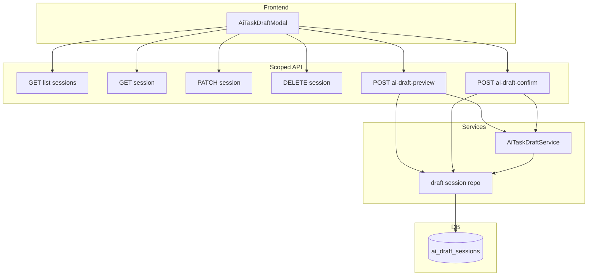

# feat: Slice 3 AI task draft — persisted draft sessions

## Overview

Add **server-side draft sessions** so AI bundle work survives **refresh, later return, and failed confirm**, without changing LLM prompts or multi-template behavior. Slice 2 stays the batch review and atomic-create foundation; this slice fulfills **R3a** (persisted draft-session artifact), strengthens **R11b** (structured errors remain tied to an editable session after refresh), and delivers the **“resume later”** success criterion from the origin roadmap. (see origin: `docs/brainstorms/2026-04-02-ai-task-job-creation-requirements.md`)

## Problem Frame

In Slice 2, the reviewed bundle lives only in the browser. Refresh or closing the tab loses work; a failed atomic create shows errors in-session but that state disappears on reload. Product intent is a **draft session** container that survives interruption and keeps **retry/fix** cycles anchored to one persisted artifact.

## Requirements Trace

- **R3a.** Draft bundle and brief are stored in a **persisted draft-session** until the user confirms creation or **explicitly discards** the session (or it expires per policy).
- **R11b (extended).** After a failed create, the session remains with **structured error detail** so the user can revise **and** see that context after refresh (not only same-browser-tab).
- **R1, R2, R8–R11a (carry).** Same multi-task bundle semantics as Slice 2; review remains structured; confirm remains all-or-nothing.
- **R14.** Sessions are **tenant-scoped** and **authenticated**; no trusting client-supplied tenant. **User isolation** within a tenant is required because `Task` / `Job` rows do not record `user_id`, but concurrent humans sharing one tenant must not see or mutate each other’s draft sessions.
- **Slice boundary.** **No** clarification loop (R7, R7a), **no** AI-assisted repair (R11c), **no** live template catalog (R4 guidance unchanged; R5/R6/R12 remain Slice 4). **No** change to adapter prompts or provider integration beyond wiring session persistence around existing `generate_preview` / `confirm_bundle`.

## Scope Boundaries

- **Templates:** Still **only** `instagram_post`, same validation as Slice 2.
- **AI behavior:** Unchanged; preview still calls existing `AiTaskDraftService.generate_preview` for new/regenerate previews.
- **R11c:** Deferred — do not auto-mutate the bundle via LLM on failure; only persist **server-returned** error metadata the user can act on.
- **Operational:** Schema continues via `SQLModel.metadata.create_all` at startup (**no Alembic** in-repo today). New table creation on existing deployments must be accounted for in rollout notes.

## Context & Research

### Relevant Code and Patterns

- `app/services/ai_task_draft_service.py` — `generate_preview`, `confirm_bundle`; normalization and atomic `task_repo.create_task_bundle_with_jobs`.
- `app/api/routes.py` — `scoped_router` uses `get_current_active_user` + `tenant_context_dependency`; AI draft handlers today take only `tenant` and must gain **`User`** for session ownership checks.
- `app/api/schemas.py` — `AiTaskDraftBundleResponse`, `AiTaskDraftBundleConfirmRequest`, `AiTaskDraftValidationErrorBody`.
- `app/models/*.py` — SQLModel tables; `JSON` columns already used on `Task` for `meta` / `post` patterns.
- `app/db/engine.py` — `create_tables()` imports `app.models`; new model must be registered in `app/models/__init__.py`.
- `tests/conftest.py` — SQLite `create_all`, patches `engine` into routes/repos.
- `frontend/src/components/AiTaskDraftModal.vue`, `frontend/src/services/api.js` — bundle state, preview/confirm; must thread **session id**, resume list, PATCH autosave, discard.

### Institutional Learnings

- No `docs/solutions/` directory in this repository.

### External References

- Not required for planning: persistence follows existing SQLModel + FastAPI patterns; session semantics are product-specific.

## Key Technical Decisions

- **New table (SQLModel):** A dedicated **draft session** entity with `id`, `tenant_id` (FK), `user_id` (FK to `users`), **`brief`** (text), **`bundle`** (JSON — serializable form of the reviewed bundle items / same information needed to confirm), optional **`last_error`** (JSON — structured failure from last confirm or last relevant server-side validation when persisted to session), **`status`** (minimal lifecycle: e.g. active vs completed vs discarded, or equivalent via timestamps), **`created_at` / `updated_at`**, and **`expires_at`** (nullable vs required TTL — recommend **config-driven TTL** with reads filtering expired rows). Exact enum names deferred to implementation. (Resolves origin “where stored” at a high level; see Deferred for column types and size limits.)
- **Authoritative confirm body:** **HTTP confirm body remains authoritative** for what gets validated and persisted to `Task`/`Job` rows; the session row is **updated to match** after successful PATCH/preview and on confirm failure so GET-after-refresh shows what the user last edited. No “confirm must match hash of stored row” in Slice 3 unless concurrency testing exposes a need — default **last-write-wins** with **`updated_at`** for audit; document **multi-tab** risk briefly in docs. If a stricter rule is chosen during implementation, encode it in tests (409 vs silent merge).
- **Session linkage (backward compatible):** Extend `AiTaskDraftRequest` with optional `draft_session_id`. Extend `AiTaskDraftBundleResponse` with `draft_session_id` **on every successful preview** (same id after update, new id after create). Request omits id on first preview; client passes id back on regenerate. API clients that do not store the id still receive valid bundle JSON. Regenerate with id **replaces** bundle on that session after successful LLM response.
- **Confirm completion:** Extend confirm request with optional `draft_session_id`. On **201 success**, mark session **completed** and **hide** from list, or **delete** row — prefer **soft “completed”** or **delete** with tests proving **second confirm** does not create duplicate tasks (404/409 for stale id — pick one and test).
- **Confirm failure persistence:** On **422** (validation) or **500** (DB) from confirm, when a `draft_session_id` is present, **persist** machine-usable error summary onto the session (`last_error`) so GET returns it after refresh. Do **not** store full internal stack traces or secrets.
- **CRUD endpoints (tenant-scoped router):** `GET /tasks/ai-draft-sessions` (list resumable), `GET /tasks/ai-draft-sessions/{session_id}`, `PATCH .../{session_id}` (save edited bundle + brief), `DELETE .../{session_id}` (discard). All queries filter **`tenant_id` + `user_id`** from server context **and** `session_id` from path; wrong user or tenant → **404** (avoid enumeration).
- **Payload size:** Define a **max stored payload** policy (config or Pydantic) aligned with reverse proxy / request body limits; PATCH autosave can be large — reject oversize with **413/422** without silent truncation.
- **Concurrency:** Slice 3 default **last-write-wins**; optional follow-up: optimistic version field if product requires **409** on conflict.
- **Cleanup:** Reads ignore expired sessions; optional future cron is **out of slice** unless trivial (document “manual purge” or rely on TTL filter only).

### Resolved During Planning

- **User scope:** Sessions are **per (tenant, user)** because the platform authenticates users but does not attach `user_id` to tasks.
- **Preview without client-held id:** Request body may omit `draft_session_id`; server **still** creates/updates a session on successful preview and **returns** `draft_session_id`. Clients that ignore the returned id get correct preview behavior but **no** resume until they store it.
- **R11c:** Explicitly out of scope.

### Deferred to Implementation

- Exact JSON schema for `bundle` and `last_error` fields; whether `brief` is duplicated inside JSON or column-only.
- MySQL column type for large JSON (`JSON` vs `LONGTEXT`) and index strategy (likely index `tenant_id`, `user_id`, `updated_at`).
- Max **open sessions per user** (cap list + create behavior).
- Default TTL duration and whether **list** returns expired rows with a flag or omits them entirely.
- HTTP choice for double-confirm and stale session (404 vs 409).

## Open Questions

### Resolved During Planning

- **Cross-user isolation:** Required via `user_id` on session rows and handler dependencies.
- **Confirm authority:** Client confirm body is authoritative; session mirrors last saved state for resume.

### Deferred to Implementation

- Optimistic locking vs last-write-wins final confirmation after spike on `AiTaskDraftModal` multi-tab usage.

## High-Level Technical Design

> *This illustrates the intended approach and is directional guidance for review, not implementation specification. The implementing agent should treat it as context, not code to reproduce.*

**Resume flow (conceptual):** User opens modal → list non-expired **active** sessions → optionally **GET** one to hydrate `brief` + `items` → user edits → **PATCH** (debounced) → **confirm** with body + optional `draft_session_id` → on success, session completed/deleted; on failure, **last_error** set, user refreshes, **GET** shows bundle + error.

## Implementation Units

- [x] **Unit 1: Draft session model and repository**

**Goal:** Introduce SQLModel table and repository helpers for CRUD scoped by **`tenant_id` + `user_id`**, with TTL filtering and status transitions (active / completed / discarded).

**Requirements:** R3a, R14

**Dependencies:** None

**Files:**
- Create: `app/models/ai_draft_session.py` (or equivalent single-module name consistent with repo naming)
- Modify: `app/models/__init__.py`
- Create: `app/services/ai_draft_session_repo.py` (or session table under an existing repo module if team prefers consolidation — follow prevailing `*_repo.py` style)
- Modify: `app/config.py` (TTL and caps as needed)
- Modify: `app/db/engine.py` only if `create_tables` import pattern must change (usually only `__init__.py`)
- Test: `tests/services/test_ai_draft_session_repo.py` (new)

**Approach:**
- Mirror existing model conventions (`UUID` PKs, `Field`, timestamps).
- Implement `get_for_user`, `list_active_for_user`, `upsert_bundle`, `mark_completed`, `mark_discarded`, `set_last_error`, `touch_expiry` as needed — exact function names deferred.
- Ensure `create_tables()` registers the model.

**Patterns to follow:**
- `app/models/task.py` JSON field usage; `app/services/task_repo.py` session/commit style.

**Test scenarios:**
- **Happy path:** Create session row for `(tenant, user)`; read back matches.
- **Edge case:** Expired `expires_at` excluded from list (or per chosen policy).
- **Error path:** Query with wrong `user_id` or `tenant_id` returns no row / raises not-found in repo API used by service.
- **Integration:** SQLite harness creates table and respects FK to `users` / `tenants` when those rows exist.

**Verification:**
- Repository helpers are used by services/routes only — no ad hoc `Session(engine)` in route bodies for session CRUD.

- [x] **Unit 2: Wire sessions into AI draft service and preview/confirm**

**Goal:** After successful `generate_preview`, optionally **create or update** a session row; on `confirm_bundle` **success** finalize session; on routed **validation or DB failure** with session id, **attach structured error** to session. Keep LLM and normalization logic **unchanged**.

**Requirements:** R3a, R11b (persisted retry), R14

**Dependencies:** Unit 1

**Files:**
- Modify: `app/services/ai_task_draft_service.py`
- Modify: `app/api/schemas.py` (optional fields on preview request/response and confirm request)
- Test: `tests/services/test_ai_task_draft_service.py`

**Approach:**
- Add collaborators or module functions for “persist preview result” / “record confirm outcome” to avoid bloating routes.
- **Default contract:** on **every successful preview**, **create** a session when the request omits `draft_session_id`, or **update** the referenced session when it is still active and owned; **always** return `draft_session_id` in the preview response so the UI gets durability without an extra round trip. Old clients that ignore the field behave as today. Tests must lock this. (A future “preview without persistence” flag is optional and out of Slice 3.)
- Do **not** duplicate `confirm_bundle` transaction: session updates for confirm failure happen **after** rollback of task/job write or in a separate small transaction; avoid partial tasks (existing atomic writer unchanged).

**Execution note:** Add a **confirm DB failure** test: injected `bundle_writer` raises `SQLAlchemyError`; assert **no** tasks persisted and session `last_error` populated when `draft_session_id` supplied.

**Patterns to follow:**
- Existing `AiTaskDraftValidationError` / `AiTaskDraftItemValidationError` patterns for mapping to stored `last_error`.

**Test scenarios:**
- **Happy path:** Preview with valid brief + session id updates bundle and `updated_at`.
- **Happy path:** Confirm success clears session from active list or marks completed.
- **Error path:** Confirm raises validation — session stores structured error; bundle unchanged.
- **Error path:** Confirm DB fails — session stores error; no partial tasks (reuse Slice 2 rollback tests).
- **Edge case:** Preview upstream **502** — define whether session row is updated (recommend: **do not** advance bundle on LLM failure; may set `last_error` optional).

**Verification:**
- `generate_preview` / `confirm_bundle` core invariants (template, max items) unchanged; new behavior covered by tests.

- [x] **Unit 3: HTTP routes for sessions and extended preview/confirm**

**Goal:** Expose list/get/patch/delete under `scoped_router`; pass **`User` + `Tenant`** into dependencies; extend preview/confirm handlers to accept optional session id and delegate to service.

**Requirements:** R3a, R11b, R14

**Dependencies:** Unit 2

**Files:**
- Modify: `app/api/routes.py`
- Modify: `app/api/schemas.py` (response models for session list/detail if not inlined)
- Test: `tests/api/test_ai_task_draft_routes.py`
- Test: `tests/api/test_ai_draft_session_routes.py` (new file acceptable if `routes` tests grow too large — prefer one file if manageable)

**Approach:**
- Thin routes: auth + tenant + user resolution, then service/repo calls.
- Consistent **`HTTPException(404)`** for cross-tenant / cross-user / unknown session / completed session on mutations.
- Rate-limit or body-size limits: align PATCH with existing request-size guards if present.

**Patterns to follow:**
- Existing `create_ai_task_draft_preview` error translation and `_ai_draft_validation_detail`.

**Test scenarios:**
- **Integration:** List returns only current user’s sessions for current tenant header.
- **Integration:** PATCH with another tenant’s session id → 404.
- **Integration:** DELETE discard removes from list.
- **Error path:** PATCH payload over size limit → stable error.
- **Integration:** Confirm with session id twice after success → second call non-success as per chosen policy.

**Verification:**
- OpenAPI reflects new paths and optional fields; no secret or raw LLM payload in responses.

- [x] **Unit 4: Frontend — resume, autosave, discard**

**Goal:** `AiTaskDraftModal` loads **resumable sessions**; user can start fresh or resume; **debounced PATCH** saves edits; preview/regenerate sends optional `draft_session_id`; confirm sends id; **tenant switch** clears session id and refetches list; discard calls **DELETE**; failed confirm shows persisted error after simulated refresh (manual or mocked).

**Requirements:** R3a, R8, R9, R11b (UX)

**Dependencies:** Unit 3

**Files:**
- Modify: `frontend/src/services/api.js`
- Modify: `frontend/src/components/AiTaskDraftModal.vue`
- Modify: `frontend/src/components/TaskList.vue` only if entrypoint must pass tenant-discard hooks (minimal)

**Approach:**
- On open: `GET .../ai-draft-sessions` → small picker or banner “Resume draft from …”.
- Store `draftSessionId` in component state; clear when modal closes without resume, on discard, or on tenant change.
- Ensure **401** path still clears auth; session id must not leak across users.

**Patterns to follow:**
- Existing modal reset patterns from Slice 2; hot-swap verification per `docs/deployment-hetzner-flow-mentoverse.md` for manual checks.

**Test scenarios:**
- **Test expectation:** none for automated Vue tests unless project adds a runner; **manual:** resume after hard refresh; confirm failure → refresh → error visible → retry succeeds; discard removes session; tenant switch drops stale id.

**Verification:**
- Manual UI pass on `mvpipeline-frontend-dev.service` + `mvpipeline-api.service` after backend landed.

- [x] **Unit 5: Documentation and rollout**

**Goal:** Update `docs/runtime-flows.md` (and `docs/architecture.md` only if a new named component should appear in the index) to describe persisted sessions, TTL, discard, and **explicit non-goals** (no R11c). Add operational note for **new table** on existing MySQL instances.

**Requirements:** Aligns with workspace doc expectations when persistence and API change; no new product features.

**Dependencies:** Unit 4

**Files:**
- Modify: `docs/runtime-flows.md`
- Modify: `docs/architecture.md` (optional)

**Test scenarios:**
- Test expectation: none — documentation only.

**Verification:**
- Docs state multi-user isolation, session lifecycle, and backward compatibility for preview without session id if retained.

## System-Wide Impact

- **Interaction graph:** New repo + routes; `AiTaskDraftService` orchestrates session persistence; frontend modal gains session lifecycle; worker/scheduler untouched.
- **Error propagation:** Confirm failures must still never imply partial tasks; session `last_error` is **supplementary** to HTTP `detail`.
- **State lifecycle risks:** Orphan sessions if PATCH never runs — mitigate with TTL and max sessions; completed sessions must not accept confirm again (test).
- **API surface parity:** New authenticated endpoints; optional fields preserve clients that omit session ids.
- **Integration coverage:** Service tests for confirm failure + session update; route tests for authz boundaries; manual E2E for refresh resume.
- **Unchanged invariants:** `instagram_post` only, no `Tenant.env` in LLM input, atomic bundle create, no AI repair loop.

## Risks & Dependencies

| Risk | Mitigation |
|------|------------|
| Missing `User` in handlers leaks cross-user drafts | Code review: every session path uses `Depends(get_current_active_user)` + composite DB filter |
| Large JSON PATCH hits MySQL / proxy limits | Configurable max size; align nginx/uvicorn body limits with docs |
| `create_all` on prod doesn’t match manual DDL expectations | Rollout note: verify new table exists before traffic; consider one-time DBA migration checklist |
| Double submit confirm creates duplicates | Session completed/deleted + second confirm returns 404/409; test explicitly |
| Last-write-wins confuses multi-tab users | Short doc note; defer optimistic locking if not painful |

## Documentation / Operational Notes

- Config: `AI_DRAFT_SESSION_*` TTL, max sessions, max stored bytes — safe defaults in `app/config.py`.
- Ops: confirm `create_tables()` or equivalent migration applied on deployment hosts using persistent MySQL.

## Sources & References

- **Origin document:** [`docs/brainstorms/2026-04-02-ai-task-job-creation-requirements.md`](docs/brainstorms/2026-04-02-ai-task-job-creation-requirements.md)
- **Prior slices:** [`docs/plans/2026-04-03-001-feat-ai-task-draft-slice-1-plan.md`](docs/plans/2026-04-03-001-feat-ai-task-draft-slice-1-plan.md), [`docs/plans/2026-04-03-002-feat-ai-task-draft-slice-2-plan.md`](docs/plans/2026-04-03-002-feat-ai-task-draft-slice-2-plan.md)
- Related code: `app/services/ai_task_draft_service.py`, `app/services/task_repo.py`, `app/api/routes.py`, `app/api/schemas.py`, `app/models/`, `frontend/src/components/AiTaskDraftModal.vue`, `frontend/src/services/api.js`
