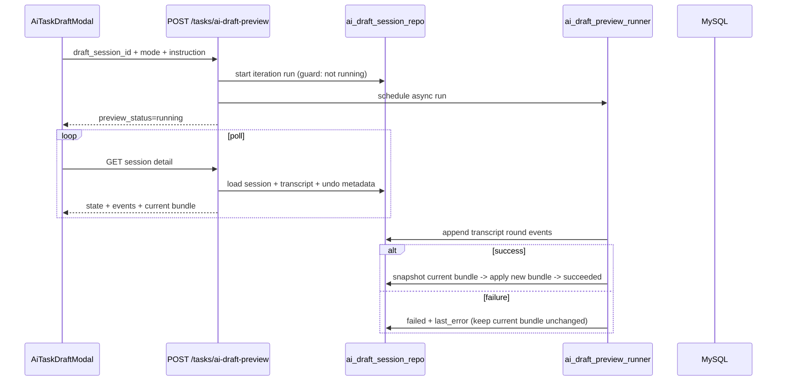

# feat: iterative instructions for existing AI drafts

## Overview

Enable users to provide additional instructions to refine an existing AI draft session, supporting both full regenerate and targeted-intent modes in a single flow. Keep current async preview architecture, but add explicit iteration contract, non-destructive failure behavior, append-only transcript rounds, and lightweight undo of recent successful revisions.

## Problem Frame

The current flow supports generating and resuming AI draft sessions, but follow-up refinement is limited to reusing `brief` + rerun behavior. That behavior currently resets transcript rows and clears bundle state on failed preview runs, which conflicts with the desired iterative workflow and increases user friction. This plan implements the refinement loop defined in the origin requirements doc (see origin: `docs/brainstorms/2026-04-16-ai-draft-iterative-instructions-requirements.md`).

## Requirements Trace

- **R1-R4**: Iteration on existing `draft_session_id` with explicit mode and instruction contract
- **R5-R7**: Replace active draft on success with user-visible lightweight undo
- **R8-R10**: Explicit preview lifecycle states, concurrency protection, and non-destructive failure handling

## Scope Boundaries

- No per-item/per-field targeting in this slice; targeted intent remains full-campaign scope only.
- No cross-session branching/version tree UI.
- No change to confirm/publish semantics outside draft refinement lifecycle.

## Context & Research

### Relevant Code and Patterns

- `app/api/schemas.py` currently defines `AiTaskDraftRequest` as `brief` + optional `draft_session_id`; it needs explicit iteration fields.
- `app/services/ai_draft_session_repo.py` currently clears transcript on rerun (`_delete_communication_events_for_session`) and clears bundle on preview failure (`finalize_preview_failure`).
- `app/services/ai_draft_preview_runner.py` is the shared async seam for preview execution; iteration orchestration should stay in shared service/repo layers, not route handlers.
- `app/api/routes.py` already enforces auth + tenant context and uses background preview execution with poll-based status.
- `frontend/src/components/AiTaskDraftModal.vue` already handles polling, transcript rendering, autosave, and resumable session UX; extend this component rather than adding a parallel flow.
- Existing test patterns live in `tests/services/test_ai_draft_session_repo.py`, `tests/services/test_ai_draft_preview_runner.py`, `tests/api/test_ai_task_draft_routes.py`, and frontend modal test files.

### Institutional Learnings

- `docs/solutions/` does not currently provide prior iterative-draft implementation guidance.

## Key Technical Decisions

- **Explicit iteration contract:** Extend preview request semantics with explicit iteration mode and follow-up instruction text instead of overloading `brief` semantics.
- **Append-only communication history per session:** Preserve transcript continuity across rounds; represent rounds via iteration metadata rather than deleting prior rows.
- **Non-destructive failure rule:** Preview failure must not replace or clear the last successful bundle.
- **Bounded undo snapshots:** Keep a small (max 3) revision history for successful round outputs only.
- **Dual-layer run guard:** Keep API-level "already running" rejection and add persistence-level transition guard to reduce race windows.

## Open Questions

### Resolved During Planning

- Undo policy shape: store full successful bundle snapshots for deterministic restore, prune oldest beyond cap.
- Iteration failure behavior: preserve active successful bundle and only update preview state + error metadata.
- Iteration contract: extend preview request with `iteration_mode`, `instruction_text`, and `target_scope` (v1 supports `target_scope='campaign'` only). Keep `brief` for first-generation and compatibility; follow-up iteration requires non-empty `instruction_text`.
- Undo API shape: add scoped restore action under draft sessions (`POST /tasks/ai-draft-sessions/{session_id}/restore`) with snapshot identifier in request body.

### Deferred to Implementation

- Whether transcript rounds are represented by explicit column(s) or encoded metadata payload per event.
- Whether undo restore itself should emit communication events (likely yes for auditability, but can be finalized during implementation).

## High-Level Technical Design

> *This illustrates the intended approach and is directional guidance for review, not implementation specification. The implementing agent should treat it as context, not code to reproduce.*

## Implementation Units

- [ ] **Unit 1: iteration request/response contract**

**Goal:** Add explicit iteration semantics to API schemas and route validation.

**Requirements:** R1, R2, R4, R8

**Dependencies:** None

**Files:**
- Modify: `app/api/schemas.py`
- Modify: `app/api/routes.py`
- Test: `tests/api/test_ai_task_draft_routes.py`

**Approach:**
- Extend preview request schema with explicit iteration fields for mode and instruction text.
- Preserve tenant/user auth and current route shape while validating v1 scope constraints (targeted intent still full-campaign).
- Backend is authoritative for validation; frontend preflight mirrors only basic required-field checks.
- Ensure route rejects conflicting combinations with actionable 422 messages and deterministic status mapping.

**Patterns to follow:**
- Existing schema `extra="forbid"` and route-side `HTTPException` validation semantics in `app/api/routes.py`.

**Test scenarios:**
- Happy path: regenerate mode on existing session returns running and schedules preview.
- Happy path: targeted-intent mode accepted with full-campaign scope.
- Edge case: missing/blank instruction text for follow-up request returns 422 with clear detail.
- Error path: request for unsupported target granularity (`item`/`field`) returns 422 with guidance.
- Error path: malformed mode/field combinations return stable 422 (not mixed 409/422 for validation class failures).

**Verification:**
- API contract is explicit and no longer depends on implicit `brief` reuse for iteration intent.

---

- [ ] **Unit 2: session repo lifecycle updates (append-only rounds + non-destructive failure)**

**Goal:** Make iteration runs preserve transcript continuity and last successful bundle safety.

**Requirements:** R3, R5, R9, R10

**Dependencies:** Unit 1

**Files:**
- Modify: `app/services/ai_draft_session_repo.py`
- Test: `tests/services/test_ai_draft_session_repo.py`

**Approach:**
- Remove destructive transcript reset on rerun; replace with round-aware append behavior.
- Update failure finalization to keep previous successful bundle intact.
- Keep preview status transitions explicit (`running`, `succeeded`, `failed`) and preserve existing tenant/user guards.
- Sanitize persisted error payloads/events before storage to avoid token/credential leakage.

**Patterns to follow:**
- Existing scoped session checks and status gates in `start_preview_run`, `finalize_preview_success`, and `finalize_preview_failure`.

**Test scenarios:**
- Happy path: second iteration on same session appends events after first round instead of deleting.
- Happy path: successful iteration updates active bundle and status succeeded.
- Error path: failed iteration keeps prior successful bundle unchanged and sets failed error metadata.
- Edge case: rerun while already running still returns 409 and does not mutate state.
- Error path: mocked upstream error containing token-like fields is sanitized before persistence/API output.

**Verification:**
- Repo tests prove no transcript wipe and no failure-time bundle wipe during follow-up runs.

---

- [ ] **Unit 3: lightweight undo snapshot persistence and restore seam**

**Goal:** Add bounded undo support for recent successful revisions in a shared backend seam.

**Requirements:** R6, R7

**Dependencies:** Unit 2

**Files:**
- Create: `app/models/ai_draft_revision_snapshot.py` (or equivalent model file)
- Modify: `app/models/__init__.py`
- Modify: `app/services/ai_draft_session_repo.py`
- Modify: `app/api/schemas.py`
- Modify: `app/api/routes.py`
- Modify: `scripts/sync_schema.py`
- Test: `tests/services/test_ai_draft_session_repo.py`
- Test: `tests/api/test_ai_task_draft_routes.py`

**Approach:**
- Persist successful pre-replace bundle snapshots per session with max retention of 3.
- Add `POST /tasks/ai-draft-sessions/{session_id}/restore` (tenant/user scoped) that swaps current bundle with selected recent snapshot.
- Keep restore unavailable while preview is running.
- Enforce restore lookup by `(tenant_id, user_id, session_id, snapshot_id)` to prevent cross-session/tenant IDOR.
- Add additive schema sync logic for snapshot persistence in existing deployment flow.

**Patterns to follow:**
- Existing SQLModel FK and scoped route patterns used by draft sessions and communication events.

**Test scenarios:**
- Happy path: each successful follow-up iteration stores undo snapshot and prunes oldest beyond cap.
- Happy path: restore last revision updates current bundle and keeps session active.
- Edge case: undo requested when no snapshot exists returns 409 with actionable message.
- Error path: restore while preview running rejected with clear contract.
- Error path: cross-tenant/cross-user/cross-session snapshot id cannot be restored (404/403 based on existing route convention).
- Edge case: after first successful follow-up iteration, at least one undo step is available.

**Verification:**
- Users can recover from recent bad generations without starting a new session.
- Undo guarantee holds after first successful revision and remains bounded to 3 snapshots.

---

- [ ] **Unit 4: preview runner integration for iteration semantics**

**Goal:** Ensure async preview runner records iteration metadata and enforces new lifecycle guarantees.

**Requirements:** R3, R5, R9, R10

**Dependencies:** Units 1-3

**Files:**
- Modify: `app/services/ai_draft_preview_runner.py`
- Modify: `app/services/ai_task_draft_service.py`
- Modify: `app/services/integrations/llm_text_adapter.py`
- Test: `tests/services/test_ai_draft_preview_runner.py`

**Approach:**
- Pass explicit iteration contract into runner execution path.
- Append round-specific transcript entries without deleting prior rounds.
- On success, snapshot current bundle then atomically persist new bundle + succeeded status.
- On failure, preserve current bundle, write error row/metadata, and set failed status.
- Apply persistence-level concurrency guard (row lock or conditional state transition update) to prevent double-running round races.

**Patterns to follow:**
- Existing runner orchestration boundaries and adapter integration patterns.

**Test scenarios:**
- Happy path: multi-round run stores ordered transcript and updates bundle on success.
- Error path: upstream/model validation failure marks failed while current bundle remains usable.
- Edge case: repeated follow-up requests during running state reject deterministically.
- Integration: runner + repo state transitions remain consistent under poll-based reads.

**Verification:**
- Async flow supports iterative refinement without regressions in polling contract.

---

- [ ] **Unit 5: modal refinement UX (mode select, instruction input, undo controls)**

**Goal:** Extend `AiTaskDraftModal` to drive iterative instructions and lightweight undo clearly.

**Requirements:** R1, R2, R6, R7, R8, R10

**Dependencies:** Units 1-4

**Files:**
- Modify: `frontend/src/components/AiTaskDraftModal.vue`
- Modify: `frontend/src/services/api.js`
- Test: `frontend/src/components/__tests__/AiTaskDraftModal*.test.*` (existing modal test location)

**Approach:**
- Add follow-up instruction UI once bundle exists (mode selector + instruction text with v1 scope disclosure).
- Reuse polling state machine with explicit `idle/running/succeeded/failed` UX cues.
- Disable conflicting actions while run is active and expose retry/edit instruction options on failure.
- Add visible undo action for recent revisions and update current bundle on restore.

**Patterns to follow:**
- Existing modal polling/autosave state management and error formatting patterns.

**Test scenarios:**
- Happy path: user runs regenerate, then targeted-intent iteration in same session.
- Happy path: user undoes last successful revision and bundle restores correctly.
- Edge case: duplicate submit while running is blocked in UI and surfaces server conflict cleanly.
- Error path: failed iteration preserves visible prior bundle and presents retry/edit actions.
- Integration: transcript pane remains coherent across multiple rounds.

**Verification:**
- Users can iterate, recover, and continue confirm flow from one session without data loss.

## System-Wide Impact

- **Interaction graph:** AI draft preview route, runner, session repo, new revision snapshot persistence, and modal state/polling UX.
- **Error propagation:** Iteration validation and failure states must remain structured and tenant/user scoped; no leaked provider secrets in transcript or errors.
- **State lifecycle risks:** Concurrent reruns, stale running status, and snapshot pruning need deterministic rules.
- **API surface parity:** All iterative semantics stay inside authenticated scoped task routes.
- **Integration coverage:** Runner/repo/API polling interactions require service + API tests beyond isolated unit behavior.
- **Unchanged invariants:** Confirm bundle atomicity and open-session cap semantics remain intact.

## Risks & Dependencies

| Risk | Mitigation |
|------|------------|
| Undo snapshot growth increases storage footprint | Cap to 3 snapshots/session and prune on every successful iteration |
| Race conditions on repeated preview clicks | Keep API 409 guard and add persistence-level transition checks |
| UX confusion around targeted intent v1 scope | Explicit copy in modal that targeted intent applies to full campaign in this slice |
| Failure handling regressions break resumability | Add regression tests ensuring failure does not clear prior successful bundle |
| Snapshot schema not rolled out in existing environments | Include additive `scripts/sync_schema.py` updates and rollout verification |

## Documentation / Operational Notes

- Update AI draft runtime docs after implementation to describe iterative instructions, undo semantics, and non-destructive failure behavior.
- If backend lifecycle behavior changes, include service restart + health verification notes per hot-swap service workflow.

## Sources & References

- **Origin document:** [docs/brainstorms/2026-04-16-ai-draft-iterative-instructions-requirements.md](docs/brainstorms/2026-04-16-ai-draft-iterative-instructions-requirements.md)
- Related plans: `docs/plans/2026-04-06-001-feat-ai-draft-communication-log-plan.md`, `docs/plans/2026-04-07-001-fix-ai-draft-session-retention-cap-plan.md`
- Related code: `app/services/ai_draft_session_repo.py`, `app/services/ai_draft_preview_runner.py`, `app/api/routes.py`, `app/api/schemas.py`, `frontend/src/components/AiTaskDraftModal.vue`
