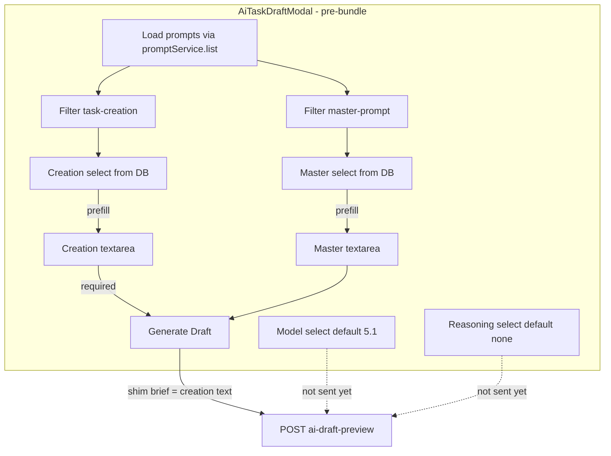

# feat: AI draft modal prompt, model, and reasoning controls (GUI-first)

## Summary

Restructure `AiTaskDraftModal.vue` so the **campaign brief is removed** and replaced by **Master Prompt** and **Creation Prompt** textareas (each with a DB-backed select that prefills from tenant `prompts` rows), plus **model** and **reasoning** controls. Reuse `promptService` and `PromptType` filtering. Preview API still accepts `brief` today — use a documented **client shim** until the backend slice adds explicit fields. Bundle review, confirm, and sessions stay; resume/brief labeling is best-effort until session schema catches up.

---

## Problem Frame

The product’s highest-leverage surface for draft quality is what operators send to the model. Tenant prompts CRUD exists (`docs/plans/2026-04-17-002-feat-tenant-prompts-crud-plan.md` explicitly deferred LLM wiring). The modal still centers a free-text **brief** while saved **master-prompt** / **task-creation** rows live only on the Prompts admin page. The UX shift is: **no brief** — the create form *is* the two prompts (prefilled from the prompts table via selects). See origin: `docs/brainstorms/2026-05-20-ai-draft-modal-prompt-config-requirements.md`.

---

## Requirements

- R1. Master Prompt and Creation Prompt UI (select + textarea each). *(origin R1–R2)*
- R2. Saved lists filtered by `master-prompt` vs `task-creation`. *(origin R3)*
- R3. Select prefills textarea body; user can edit after. *(origin R4)*
- R4. Model select 5.1 / 5.4 / 5.5, default 5.1. *(origin R5)*
- R5. Reasoning select none / low / medium / high, default none. *(origin R6)*
- R6. Frontend-only slice; preview API omission acceptable. *(origin R7–R8)*
- R7. **Remove** campaign brief UI; Master + Creation are the form inputs. *(origin R9)*
- R8. Generate gated on prompt text (creation required; master required unless product waives during impl). *(origin R11)*
- R9. Preserve session resume, bundle review, confirm, transcript. *(origin R10)*

**Origin acceptance examples:** AE1, AE2, AE3, AE4, AE5

---

## Scope Boundaries

- Changing `AiTaskDraftRequest`, `ai_draft_preview_runner`, or `llm_text_adapter.py` behavior.
- Autosaving model/prompt fields on `PATCH /tasks/ai-draft-sessions/{id}` (session patch is brief + items only today).
- Adding `@vue/test-utils` or full component mount tests (not in `frontend/package.json` today).
- Replacing or removing follow-up iteration UI (`instructionText`, `iterationMode`).

### Deferred to Follow-Up Work

- **Backend integration PR:** Extend preview request schema; pass master/creation text, model, reasoning into adapter; split system/user message construction; map reasoning to provider parameter; update communication-event logging; service + API tests. Target files: `app/api/schemas.py`, `app/api/routes.py`, `app/services/ai_draft_preview_runner.py`, `app/services/integrations/llm_text_adapter.py`, `app/services/ai_task_draft_service.py`, `tests/api/test_ai_task_draft_routes.py`, `tests/services/test_llm_text_adapter.py`.
- **Session persistence (optional):** Store `ai_config` on `ai_draft_sessions` so resume restores model/prompt choices.
- **Docs:** Update operator-facing deployment/docs if env `AI_TASK_DRAFT_MODEL` becomes secondary to per-request model.

---

## Context & Research

### Relevant Code and Patterns

- **Modal:** `frontend/src/components/AiTaskDraftModal.vue` — remove brief textarea (~L57–65); `generateDraft` currently requires `trimmedBrief` ~L851–867; autosave sends `brief` ~L584–587; resume hydrates `this.brief` ~L622.
- **Prompts API:** `frontend/src/services/api.js` → `promptService.list()`; no server-side type filter — **filter client-side** like `PromptsView.vue` type options (`task-creation`, `master-prompt`).
- **Types:** `app/models/prompt.py` — `PromptType.TASK_CREATION`, `PromptType.MASTER_PROMPT`.
- **LLM today:** `app/services/integrations/llm_text_adapter.py` — single `_system_prompt()`, `complete_preview_chat` sends `model: self.model` only (no reasoning).
- **Pure JS tests pattern:** `frontend/src/components/aiDraftTranscriptFormatting.js` + `frontend/src/components/__tests__/aiDraftTranscriptFormatting.spec.js` (vitest, no Vue Test Utils).

### Institutional Learnings

- `docs/solutions/logic-errors/ai-draft-session-cap-trim-deletes-history-2026-04-07.md` — draft session lifecycle is sensitive; avoid expanding autosave payload in GUI slice without explicit schema work.

### External References

- Skipped: local patterns sufficient for GUI; OpenAI parameter names deferred to follow-up (verify against current Responses/Chat Completions docs when wiring 5.x + reasoning).

---

## Key Technical Decisions

- **Extract pure helpers** (`aiDraftPromptConfig.js`) for type filtering and prefill logic so vitest can cover R2–R4 without mounting the modal. *(see origin AE1–AE2)*
- **No brief in UI:** Delete `brief` from the pre-bundle template; subtitle copy updated to describe master + creation prompts instead of “from a brief.”
- **Generate gate:** Replace `trimmedBrief` with validation on `creationPromptText` (and `masterPromptText` if both required). Disable button until satisfied.
- **API shim (GUI slice):** Build `previewPayload.brief` from prompts for backward compatibility — recommended: `creationPromptText.trim()` only, or `JSON.stringify({ master, creation })` if adapter/logs need both before schema change. Document chosen shim in U3; do **not** send empty brief.
- **Autosave / resume:** `flushAutosave` and `resumeSession` use the same shim string for `brief` until session patch stores split fields. Resume list label: first ~80 chars of creation text (or shim), not “(No brief text).”
- **Internal state:** Remove `brief` / `trimmedBrief` computed; replace watchers on `brief` with watchers on prompt text fields for autosave scheduling when bundle exists.
- **Select sentinel:** First option “Custom (no saved prompt)” with empty value; prefill runs only when a real prompt id is selected.
- **Model/reasoning values:** Store UI tokens `5.1` | `5.4` | `5.5` and `none` | `low` | `medium` | `high` in component state; map to provider ids in follow-up (planning assumption: labels are product-facing until API wiring).
- **Prompt load timing:** Fetch prompts when modal opens (`visible` + `tenantId`), same as `loadResumableSessions`; clear catalogs when tenant missing.
- **Layout:** Single primary card (or stacked form groups): **Master Prompt** (select + textarea), **Creation Prompt** (select + textarea), then **Model** and **Reasoning** on one row; then resume list and actions. No brief block.

---

## Open Questions

### Resolved During Planning

- **Generate validation:** Creation text required; master required too (aligns with origin R11).
- **Brief shim:** Use creation prompt text as `brief` on preview/autosave until backend removes the field.
- **API list filter:** Client-side filter on full `promptService.list()` result (≤100 rows default).

### Deferred to Implementation

- Exact OpenAI model strings and `reasoning_effort` (or equivalent) field for 5.x models.
- Whether master prompt is optional when creation + brief are present (adapter design in follow-up).

---

## High-Level Technical Design

> *Directional guidance for review, not implementation specification.*

---

## Implementation Units

- U1. **Prompt config helpers + unit tests**

**Goal:** Testable filtering/prefill/option constants shared by the modal.

**Requirements:** R2, R3

**Dependencies:** None

**Files:**
- Create: `frontend/src/components/aiDraftPromptConfig.js`
- Create: `frontend/src/components/__tests__/aiDraftPromptConfig.spec.js`

**Approach:**
- Export `PROMPT_TYPE_MASTER`, `PROMPT_TYPE_CREATION`, `AI_DRAFT_MODEL_OPTIONS`, `AI_DRAFT_REASONING_OPTIONS`, `DEFAULT_AI_DRAFT_MODEL`, `DEFAULT_AI_DRAFT_REASONING`.
- Export `filterPromptsByType(prompts, type)` and `bodyForPromptId(prompts, id)`.
- Export `applyPromptSelection({ prompts, type, selectedId, currentText })` returning `{ text, selectedId }` (prefill body when id set; leave text when id empty).

**Patterns to follow:**
- `frontend/src/components/aiDraftTranscriptFormatting.js`

**Test scenarios:**
- Happy path: filter returns only matching `type`.
- Edge case: empty prompt list → select has only custom option.
- Happy path: `applyPromptSelection` with valid id replaces text with `body`.
- Edge case: empty id leaves `currentText` unchanged.
- Edge case: unknown id leaves text unchanged.

**Verification:**
- `npm test` passes for new spec file.

---

- U2. **Remove brief; add prompt state, loading, and API shim helpers**

**Goal:** Replace `brief` state with master/creation prompts; centralize shim for preview/autosave.

**Requirements:** R7, R8, R9

**Dependencies:** U1

**Files:**
- Modify: `frontend/src/components/AiTaskDraftModal.vue`
- Modify: `frontend/src/components/aiDraftPromptConfig.js` (add `buildPreviewBriefShim({ masterText, creationText })` export)

**Approach:**
- Remove `brief`, `trimmedBrief`; add prompt + model state per Key Technical Decisions.
- Add `canGenerate` computed: creation (and master) text non-empty.
- `loadPrompts()` on open; filtered lists for selects.
- `buildPreviewBriefShim` returns creation text (documented default) for `payload.brief` and autosave `body.brief`.
- `resumeSession`: map `data.brief` into `creationPromptText` only (master empty) until session stores split fields; update `resumeLabel` to use creation excerpt.
- Replace `watch.brief` with watch on prompt text fields.
- Update `generateDraft` validation message (“Enter creation prompt first.”).

**Patterns to follow:**
- `loadResumableSessions()` error handling

**Test scenarios:**
- Add to `aiDraftPromptConfig.spec.js`: shim returns trimmed creation text; empty creation → falsy/throw per helper contract.

**Verification:**
- No `brief` in component `data`; grep component for `v-model="brief"` returns zero.

---

- U3. **Form layout: selects prefill textareas + model/reasoning**

**Goal:** Operator-facing form replaces brief (origin AE1–AE4).

**Requirements:** R1–R6, R7, R8

**Dependencies:** U2

**Files:**
- Modify: `frontend/src/components/AiTaskDraftModal.vue` (template + styles)

**Approach:**
- Remove brief `<textarea>` and related label/help.
- For each prompt slot: label, `<select>` (saved prompt name, value = id), `<textarea>` (rows ~6–8).
- `@change` on select → prefill corresponding textarea from `prompt.body`.
- Model + reasoning row below prompts.
- Update header subtitle: draft from configured prompts, not “from a brief.”
- `:disabled="generating || confirming"` on controls.
- Generate button uses `canGenerate` not `trimmedBrief`.
- `generateDraft` sends `brief: buildPreviewBriefShim(...)`.

**Patterns to follow:**
- `frontend/src/views/PromptsView.vue` type labels

**Test scenarios:**
- Test expectation: none — manual UX via hot-swap frontend service.

**Verification:**
- AE4: no brief field visible; AE1/AE2: selects prefill; AE5: network preview payload includes shim `brief`.

---

- U4. **Follow-up specification in repo docs**

**Goal:** Clean handoff for backend slice (origin R8).

**Requirements:** R6

**Dependencies:** U3 (field names stable)

**Files:**
- Modify: `docs/brainstorms/2026-05-20-ai-draft-modal-prompt-config-requirements.md` — add “Implementation notes” subsection listing proposed request fields, or
- Create: `docs/plans/2026-05-20-002-feat-ai-draft-backend-prompt-model-plan.md` stub (optional; prefer a **Follow-up** section in this plan only to avoid plan sprawl)

**Approach:**
- Append to **Deferred to Follow-Up Work**: remove `brief` from `AiTaskDraftRequest`; add `master_prompt_text`, `creation_prompt_text`, `model`, `reasoning`; optional prompt ids for provenance; migrate `ai_draft_sessions.brief` → JSON or separate columns; adapter uses master as system/developer message and creation as user campaign instruction (no brief concat).
- Remove client `buildPreviewBriefShim` once API ships.
- No code changes in U4 unless team wants a dedicated second plan file — default is updating this plan’s deferred section only during U4.

**Test scenarios:**
- Test expectation: none — documentation only.

**Verification:**
- Deferred section lists every file touched in backend slice; implementer does not need to infer GUI field names.

---

## System-Wide Impact

- **Interaction graph:** Only `AiTaskDraftModal` and new helper module; `TaskList.vue` unchanged (still passes `tenantId`).
- **Error propagation:** Prompt load failures surface in modal `error` or inline banner; do not block brief entry.
- **API surface parity:** `POST /tasks/ai-draft-preview` unchanged in this PR.
- **Unchanged invariants:** Confirm flow, autosave (items + shim brief), session list/resume, async polling.

---

## Risks & Dependencies

| Risk | Mitigation |
|------|------------|
| Operators assume model/reasoning affect generation immediately | Help text: model/reasoning wired in next slice; creation text drives preview via brief shim |
| Resume shows old sessions as brief-only | Resume maps brief → creation textarea; master empty until DB migration |
| Large prompt bodies slow textarea | Same as Prompts admin; no new limit in GUI slice |
| Model labels ≠ OpenAI ids | Follow-up maps tokens; transcript logs resolved id |
| Tenant with no saved prompts | Empty selects + custom-only path still works |

---

## Documentation / Operational Notes

- After backend slice: document per-request model override vs `AI_TASK_DRAFT_MODEL` env in `docs/deployment-hetzner-flow-mentoverse.md` if behavior changes.
- Validate via hot-swap: `mvpipeline-frontend-dev.service` (no duplicate Vite).

---

## Sources & References

- **Origin document:** [docs/brainstorms/2026-05-20-ai-draft-modal-prompt-config-requirements.md](docs/brainstorms/2026-05-20-ai-draft-modal-prompt-config-requirements.md)
- Prior prompts CRUD plan: `docs/plans/2026-04-17-002-feat-tenant-prompts-crud-plan.md`
- Modal: `frontend/src/components/AiTaskDraftModal.vue`
- Adapter: `app/services/integrations/llm_text_adapter.py`
