# feat: AI draft Max Tasks and Max Jobs limits (GUI + JSON Schema)

## Summary

Add **Max Tasks** and **Max Jobs** selects (1–10) to the AI draft modal immediately below the master prompt textarea, defaulting to **2** tasks and **4** jobs per task. Send these values on every preview request so the backend builds OpenAI structured-output JSON Schema with matching `maxItems` caps and enforces the same limits after parsing.

---

## Problem Frame

The completed GUI and backend prompt plans wired master/creation prompts, model, and reasoning, but bundle size is still governed only by the global env default `AI_TASK_DRAFT_MAX_BUNDLE_ITEMS` (12 tasks) with no per-task job ceiling in JSON Schema. Operators cannot steer “how big” a draft should be from the modal. This follow-up exposes that control in the form and threads it through preview → schema → validation.

---

## Requirements

- R1. Modal shows **Max Tasks** and **Max Jobs** as `<select>` options for integers 1–10.
- R2. Defaults: Max Tasks **2**, Max Jobs **4**.
- R3. Controls sit **below the master prompt textarea** and above the creation prompt section.
- R4. Initial preview `POST /tasks/ai-draft-preview` includes `max_tasks` and `max_jobs`.
- R5. JSON Schema sets `items.maxItems = max_tasks` and each item’s `jobs.maxItems = max_jobs`.
- R6. Post-LLM validation rejects bundles that exceed the same per-request limits (defense in depth).
- R7. Follow-up previews (with `draft_session_id`) keep consistent limits when the client omits fields (reuse first `USER_INPUT` payload or session defaults).
- R8. Preserve existing flows: async preview, polling, bundle review, confirm, session cap behavior.

---

## Scope Boundaries

- Persisting `max_tasks` / `max_jobs` on `ai_draft_sessions` columns (resume across days).
- Per-tenant saved defaults or prompts-table metadata.
- Changing `AI_TASK_DRAFT_MAX_BUNDLE_ITEMS` env semantics globally (it remains a server ceiling; per-request values are clamped to 1–10 and must not exceed the env cap when env &lt; 10).
- Confirm-path changes beyond using the already-stored bundle. **v1:** limits apply to **LLM generation only**; manual review can still add jobs up to existing env task cap (12) — not bounded by `max_jobs` at confirm time.
- Surfacing limits in operator deployment docs unless env/behavior changes materially.

### Deferred to Follow-Up Work

- **Session columns:** `max_tasks`, `max_jobs` on `ai_draft_sessions` for list/resume UI restoration.
- **Creation prompt context:** Inject limits into `build_initial_preview_messages` user text (optional nudge); schema caps are sufficient for v1.

---

## Context & Research

### Relevant Code and Patterns

- **Modal layout:** `frontend/src/components/AiTaskDraftModal.vue` — master block ~L63–88, creation block ~L91–117, model/reasoning row ~L119+.
- **Shared GUI constants:** `frontend/src/components/aiDraftPromptConfig.js` — mirror `AI_DRAFT_MODEL_OPTIONS` pattern for limit selects.
- **Request schema:** `app/api/schemas.py` — `AiTaskDraftRequest` with `extra="forbid"`.
- **JSON Schema:** `app/services/integrations/ai_draft_response_schema.py` — `draft_bundle_json_schema(max_items=…)`; `jobs` array currently has **no** `maxItems`.
- **LLM call:** `app/services/integrations/llm_text_adapter.py` — passes `max_items=self.max_bundle_items` from adapter init (env default 12).
- **Validation:** `app/services/ai_task_draft_service.py` — `max_bundle_items` on service; min 1 job per task, no max jobs today.
- **Runner / route:** `app/services/ai_draft_preview_runner.py`, `app/api/routes.py` — `job_kwargs` plumbing for model/reasoning.
- **Tests:** `tests/services/integrations/test_ai_draft_response_schema.py`, `tests/services/test_llm_text_adapter.py`, `tests/api/test_ai_task_draft_routes.py`, `frontend/src/components/__tests__/aiDraftPromptConfig.spec.js`.

### Institutional Learnings

- `docs/solutions/logic-errors/ai-draft-session-cap-trim-deletes-history-2026-04-07.md` — do not expand autosave/session payloads in ways that fight cap semantics; this feature only adds preview request fields, not session trim behavior.

### External References

- Skipped: OpenAI strict JSON Schema patterns already established in-repo.

---

## Key Technical Decisions

- **API field names:** `max_tasks` and `max_jobs` as integers on `AiTaskDraftRequest` (optional with server defaults 2 and 4 when omitted).
- **Allowed range:** 1–10 inclusive on API and UI; Pydantic `Field(ge=1, le=10)`.
- **Server ceiling:** Effective task cap = `min(request.max_tasks, AI_TASK_DRAFT_MAX_BUNDLE_ITEMS)` so env can still bound operators if lowered below 10.
- **Schema builder signature:** Extend `draft_bundle_json_schema(*, max_items: int, max_jobs: int)`; parameterize `_draft_item_schema(max_jobs)` for `jobs.maxItems`.
- **Per-preview adapter call:** Pass `max_tasks` / `max_jobs` into `complete_preview_chat(...)` instead of relying solely on adapter constructor defaults — follow-ups use the same resolved limits as the initial run.
- **Service validation:** Construct `AiTaskDraftService(adapter, max_bundle_items=resolved_tasks, max_jobs_per_item=resolved_jobs)` in the preview runner so post-parse checks match schema.
- **Follow-up resolution (frozen caps):** When `draft_session_id` is set, always use limits from the **earliest** `USER_INPUT` event for that session — ignore newly sent `max_tasks`/`max_jobs` on follow-ups so caps stay stable for the conversation. If the event lacks limits (legacy session), fall back to 2/4.
- **Single resolution point:** Resolve limits once in the preview route (`_resolve_preview_limits`) and pass integers through `job_kwargs` → runner → adapter → service; downstream must not re-default.
- **UI placement:** One row with two selects directly under the master prompt `<textarea>`, before the creation prompt `form-group`.
- **Logging:** Include `max_tasks` and `max_jobs` in `USER_INPUT` and `PROMPT_TO_AI` payloads (limits only on schema side for the latter is implicit via adapter).

---

## Open Questions

### Resolved During Planning

- **Tasks vs env cap:** Per-request cap wins up to env ceiling via `min()`.
- **Jobs limit:** Apply at JSON Schema `jobs.maxItems` and post-parse `len(jobs) > max_jobs` per item.

### Deferred to Implementation

- Whether to add a short help line under the selects (“Limits apply to this generation only”).
- Exact error message copy when LLM returns too many jobs on one task.

---

## High-Level Technical Design

> *Directional guidance for review, not implementation specification.*

```mermaid
flowchart LR
  Modal[AiTaskDraftModal selects]
  API[POST ai-draft-preview]
  Route[routes job_kwargs]
  Runner[preview_runner]
  Adapter[complete_preview_chat]
  Schema[draft_bundle_json_schema]
  Svc[validate_raw_llm_dict]

  Modal -->|max_tasks max_jobs| API
  API --> Route --> Runner
  Runner --> Adapter
  Adapter --> Schema
  Schema -->|maxItems on items and jobs| OpenAI[OpenAI API]
  OpenAI --> Svc
```

---

## Implementation Units

- U1. **Frontend limit constants and helpers**

**Goal:** Reusable 1–10 options and defaults for modal + vitest.

**Requirements:** R1, R2

**Dependencies:** None

**Files:**
- Modify: `frontend/src/components/aiDraftPromptConfig.js`
- Modify: `frontend/src/components/__tests__/aiDraftPromptConfig.spec.js`

**Approach:**
- Export `AI_DRAFT_LIMIT_OPTIONS` (values 1–10 as strings or numbers consistent with model selects).
- Export `DEFAULT_AI_DRAFT_MAX_TASKS = 2`, `DEFAULT_AI_DRAFT_MAX_JOBS = 4`.
- Export `clampDraftLimit(value, fallback)` or `parseDraftLimit(value)` for safe coercion from select strings.

**Patterns to follow:**
- `AI_DRAFT_MODEL_OPTIONS` in the same module

**Test scenarios:**
- Happy path: defaults are 2 and 4.
- Edge case: invalid/out-of-range string coerces to fallback.
- Happy path: `AI_DRAFT_LIMIT_OPTIONS` length is 10.

**Verification:**
- Vitest spec passes.

---

- U2. **Modal UI and preview payload**

**Goal:** Operators set limits below master prompt; values sent on generate and follow-up when applicable.

**Requirements:** R1, R2, R3, R4

**Dependencies:** U1

**Files:**
- Modify: `frontend/src/components/AiTaskDraftModal.vue`

**Approach:**
- Add `maxTasks` / `maxJobs` state initialized from defaults.
- Template: after master textarea, add `ai-draft-limits-row` with two labeled selects bound to state.
- Include `max_tasks` and `max_jobs` in `generateDraft` payload (parse to integers).
- Reset limits to defaults in `resetState()` when closing/clearing the modal.
- On `resumeSession()`, hydrate `maxTasks` / `maxJobs` from the earliest `user_input` event in `communication_events` (same rule as backend); fall back to defaults when missing.
- Follow-ups may omit limit fields; backend freezes caps from the first `USER_INPUT` (no need to resend on iteration).

**Patterns to follow:**
- `ai-draft-model-reasoning-row` layout

**Test scenarios:**
- Test expectation: none — manual UX via hot-swap frontend; helper coverage in U1.

**Verification:**
- Network payload on Generate includes `max_tasks: 2`, `max_jobs: 4` by default; selects visible between master and creation sections.

---

- U3. **API request schema and limit resolution**

**Goal:** Typed, validated request fields; route passes resolved limits to background job.

**Requirements:** R4, R7

**Dependencies:** None (can parallel with U1)

**Files:**
- Modify: `app/api/schemas.py`
- Modify: `app/api/routes.py`
- Modify: `tests/conftest.py` (`ai_draft_preview_request` defaults optional)
- Modify: `tests/api/test_ai_task_draft_routes.py`

**Approach:**
- Add `max_tasks: Optional[int] = Field(default=None, ge=1, le=10)` and `max_jobs` similarly.
- Add helper `_resolve_preview_limits(data, draft_session_id, tenant_id, user_id) -> tuple[int, int]` — sole resolution point: defaults 2/4 on initial preview; on follow-up, read earliest `USER_INPUT` event (ignore new limit fields); apply `min(max_tasks, AI_TASK_DRAFT_MAX_BUNDLE_ITEMS)` for tasks.
- Extend `job_kwargs` with `max_tasks`, `max_jobs`.
- Reject unknown fields still covered by `extra="forbid"`.

**Patterns to follow:**
- `_resolve_preview_prompts` in `routes.py`

**Test scenarios:**
- Happy path: request with `max_tasks: 3`, `max_jobs: 5` accepted.
- Error path: `max_tasks: 0` or `11` → 422.
- Error path: legacy field `max_items` rejected (forbid).
- Edge case: follow-up with `draft_session_id` ignores newly sent `max_tasks: 10` and keeps first-run limits.
- Edge case: follow-up with `draft_session_id` only reuses limits from first `USER_INPUT` event when client omits fields.

**Verification:**
- Route tests pass; OpenAPI/schema allows new fields only.

---

- U4. **JSON Schema and LLM adapter wiring**

**Goal:** OpenAI `response_format` encodes both caps.

**Requirements:** R5

**Dependencies:** U3

**Files:**
- Modify: `app/services/integrations/ai_draft_response_schema.py`
- Modify: `app/services/integrations/llm_text_adapter.py`
- Modify: `tests/services/integrations/test_ai_draft_response_schema.py`
- Modify: `tests/services/test_llm_text_adapter.py`

**Approach:**
- Change `draft_bundle_json_schema(max_items, max_jobs)` to set `jobs.maxItems` inside item schema.
- `complete_preview_chat(..., max_tasks=None, max_jobs=None)` resolves defaults (2/4) and calls schema builder with `min(max_tasks, self.max_bundle_items)` for items cap.
- Keep adapter `max_bundle_items` as env-backed ceiling.

**Patterns to follow:**
- Existing strict-schema tests in `test_ai_draft_response_schema.py`

**Test scenarios:**
- Happy path: schema with `max_items=2` has `items.maxItems == 2`.
- Happy path: schema with `max_jobs=4` has `jobs.maxItems == 4` on item schema.
- Happy path: strict-compliance walker still passes for combined limits.
- Integration: adapter test asserts captured `response_format` reflects passed limits.

**Verification:**
- Schema and adapter tests green.

---

- U5. **Preview runner and service validation**

**Goal:** End-to-end preview honors limits after LLM response.

**Requirements:** R6, R7, R8

**Dependencies:** U3, U4

**Files:**
- Modify: `app/services/ai_draft_preview_runner.py`
- Modify: `app/services/ai_task_draft_service.py`
- Modify: `tests/services/test_ai_task_draft_service.py`
- Modify: `tests/services/test_ai_draft_preview_runner.py` (if present or add targeted case)

**Approach:**
- Extend `run_ai_draft_preview_job(..., max_tasks, max_jobs)`.
- Log limits in `USER_INPUT` payload.
- Pass limits into `complete_preview_chat` and construct `AiTaskDraftService(..., max_bundle_items=resolved_tasks, max_jobs_per_item=resolved_jobs)`.
- In `_normalize_item` or after item validation, raise `AiTaskDraftItemValidationError` when `len(jobs) > max_jobs_per_item`.

**Patterns to follow:**
- Existing `max_bundle_items` rejection test

**Test scenarios:**
- Happy path: 2 items and 3 jobs each pass when limits are 2 and 4.
- Error path: 3 items when `max_tasks=2` fails on field `items`.
- Error path: 5 jobs on one task when `max_jobs=4` fails with item index and field `jobs`.

**Verification:**
- Service tests cover job count cap; preview runner passes limits to adapter in a mocked test if feasible.

---

## System-Wide Impact

- **Interaction graph:** Modal → preview route → runner → adapter/schema; confirm and session list unchanged.
- **Error propagation:** Validation errors surface as existing 422 preview failures with `field` hints.
- **State lifecycle risks:** Follow-up without limits must not silently widen caps — resolved from first user input.
- **API surface parity:** Only `POST /tasks/ai-draft-preview` request shape changes; session PATCH/GET unchanged in v1.
- **Unchanged invariants:** Session count cap (`409`), bundle byte cap, min 1 task and min 1 job per task, instagram_post template.

---

## Risks & Dependencies

| Risk | Mitigation |
|------|------------|
| Env `AI_TASK_DRAFT_MAX_BUNDLE_ITEMS` &lt; user-selected tasks | Clamp with `min(request, env)`; document if env ever set below 10 |
| Follow-up omits limits and first event missing | Default 2/4; log warning only in dev if needed |
| Strict schema rejects valid smaller bundles | `maxItems` is upper bound only — no `minItems` change |
| Operators expect limits on confirm | Stored bundle already validated at preview time |

---

## Documentation / Operational Notes

- No deployment doc change required unless product wants env vs UI limits explained.
- Validate via hot-swap: `mvpipeline-api.service` restart after backend changes; `mvpipeline-frontend-dev.service` for UI.

---

## Sources & References

- **Prior plans:** [docs/plans/2026-05-20-001-feat-ai-draft-modal-prompt-config-plan.md](docs/plans/2026-05-20-001-feat-ai-draft-modal-prompt-config-plan.md), [docs/plans/2026-05-21-001-feat-ai-draft-backend-prompt-wiring-plan.md](docs/plans/2026-05-21-001-feat-ai-draft-backend-prompt-wiring-plan.md)
- JSON Schema module: `app/services/integrations/ai_draft_response_schema.py`
- Config default (12 tasks): `app/config.py` (`AI_TASK_DRAFT_MAX_BUNDLE_ITEMS`)
- Runtime flow: `docs/runtime-flows.md`
