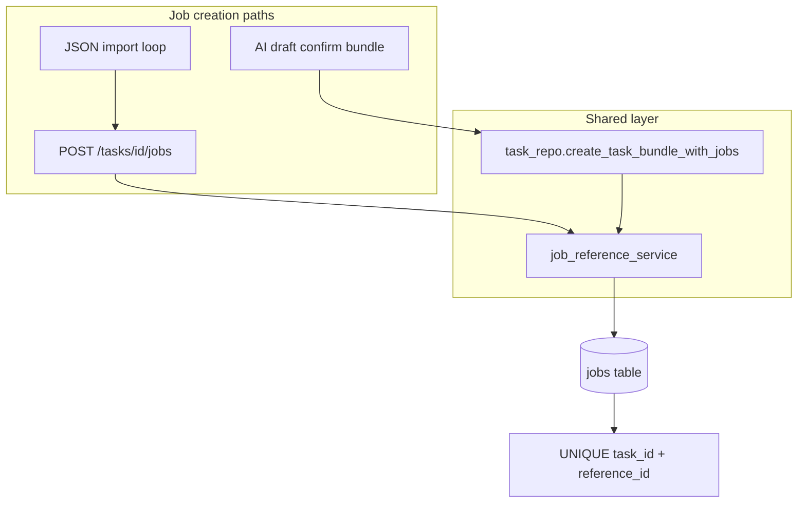
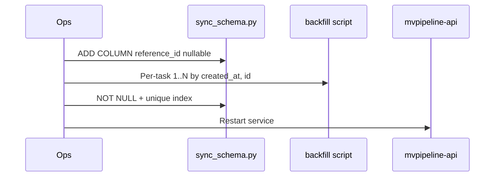

# feat: Add per-task job reference_id

## Summary

Introduce a create-only, per-task integer `reference_id` on `Job` as a stable slot identity (1, 2, 3…) separate from display `order`. Centralize assignment and uniqueness in a shared backend service, roll out via additive schema sync plus a one-time backfill, and apply a consistent three-key sort (`order` DESC → `reference_id` ASC → `created_at` ASC) on canonical task-scoped job queries. Cross-job resolution in prompts and processors remains deferred.

---

## Problem Frame

Jobs already have a UUID primary key and an `order` field for display and manual reordering. UUIDs are awkward for pipeline authoring in JSON or AI drafts, and many jobs share the same `order` (often `0`), so list ordering falls back to `created_at`, which does not reflect intentional slot identity.

A dedicated `reference_id` gives each job a small, task-local handle for tie-breaking after `order` and for future job-to-job references. This plan establishes the field, assignment rules, migration, and sort behavior only — not prompt/processor resolution or worker pick order. (see origin: `docs/brainstorms/2026-06-01-job-reference-id-requirements.md`)

---

## Requirements

**Data model and migration**
- R1. Each `Job` row stores a non-null integer `reference_id` scoped to its parent task.
- R2. `reference_id` values are unique within a task.
- R3. On deploy, existing jobs are backfilled per task: assign 1..N ordered by `created_at` ASC, with `id` ASC as tie-break when timestamps match.
- R14. Add a database unique index on `(task_id, reference_id)` in v1; map constraint violations to clear API errors.

**Assignment on create**
- R4. When a job is created without an explicit `reference_id`, assign `max(existing reference_id for task) + 1`, or `1` when the task has no jobs.
- R5. When created with an explicit `reference_id`, store that value if unused on the same task.
- R6. If an explicit `reference_id` conflicts with an existing job on the same task, fail with a clear validation error (no silent auto-bump).
- R15. `reference_id` must be an integer ≥ 1 on all create surfaces.
- R16. When multiple jobs are created in one transaction without explicit IDs, assign sequential slots in persisted order (after preview `order` sort for AI bundles), not repeated `max+1` reads.

**Immutability and API**
- R7. `reference_id` cannot be changed after create (not on `JobUpdate`; reject if sent).
- R8. Job read responses expose `reference_id`.
- R9. Job create schemas accept optional `reference_id` (create-only); all creation entry points use the same assignment rules: REST `create_job`, AI draft `confirm_bundle` / `create_task_bundle_with_jobs`, JSON import (via repeated REST creates).
- R10. `order` remains independent; setting `reference_id` does not set `order`.

**Listing and sort**
- R11. Canonical task-scoped job lists sort: `order` DESC, `reference_id` ASC, `created_at` ASC.
- R12. Apply that sort at minimum on task detail (`GET /tasks/{id}` jobs) and Instagram publish job selection; other task-scoped loaders that affect user-visible sequence or publish ordering must use the same helper or document why not.

**Future references (out of scope for behavior)**
- R13. No prompt/processor logic resolves job-to-job references by `reference_id` yet.

---

## Key Technical Decisions

- **Shared assignment service**: New `app/services/job_reference_service.py` owns auto-assign, explicit validation, in-bundle duplicate detection, and batch sequential assign. Called from `create_job` route and `task_repo.create_task_bundle_with_jobs` / AI draft confirm — not duplicated in routes. (see `docs/decisions/001-shared-application-workflows.md`)
- **DB unique index in v1**: `(task_id, reference_id)` unique index after backfill; pre-insert validation for friendly 422s; `IntegrityError` mapped as fallback under concurrency.
- **Centralized sort helper**: e.g. `jobs_for_task_ordered(session, task_id, *, purpose=None)` in `task_repo` or `job_reference_service`, used by `get_task` and `publisher_instagram`.
- **Schema rollout**: Add column via `scripts/sync_schema.py` `ADD_COLUMN_DDL`; one-time `scripts/backfill_job_reference_ids.py`; enforce NOT NULL + unique index; documented deploy order (sync → backfill → restart API) in `docs/deployment-hetzner-flow-mentoverse.md`.
- **Create-only on update**: Reject `reference_id` on `JobUpdate` with 422 if present.
- **REST duplicate errors**: Pre-validate before flush; return 422 with field-level detail.
- **UI column deferred**: API exposes `reference_id`; TaskDetail table column left out of v1; align client-side `instagramImageJobs` sort with API tie-break.
- **JSON import**: Remains N non-atomic API calls; partial failure documented; error includes job index when possible.

---

## Acceptance Examples

- **Covers R3 / backfill:** Given a task with three jobs created at different times, when backfill runs, then the oldest job has `reference_id` 1 and the newest has 3.
- **Covers R4:** Given a task whose highest `reference_id` is 5, when a job is created without an explicit id, then the new job has `reference_id` 6.
- **Covers R6:** Given a task with `reference_id` 2 in use, when create sends explicit `reference_id` 2, then the API returns 422 and no new row is created.
- **Covers R11:** Given two jobs with the same `order` and different `reference_id`, when the task is loaded via API, then the job with the lower `reference_id` appears before the other (after `order` tie).
- **Covers R10:** Given create with `reference_id` 3 and default `order`, when the job is read back, then `order` is still the default (0) unless explicitly set.

---

## High-Level Technical Design

**Deploy sequence**

---

## Scope Boundaries

**Deferred for later** (from origin)
- Job-type-specific reference fields in `prompt` JSON and processor resolution by `reference_id`.
- Renumbering or compacting slots after deletes (gaps acceptable).
- AI draft LLM strict schema + modal editor for optional `reference_id` (v1: AI path auto-assigns only).
- Bulk JSON import endpoint or automatic rollback on partial import failure.
- Task detail UI column for `reference_id`.

**Outside this change** (from origin)
- Removing or repurposing `order`.
- Changing worker job pick order (`app/worker.py` uses `created_at` only — unchanged).
- Cross-task or global reference identifiers.

**Deferred to follow-up work**
- Sort on `approve_task_for_processing` / processor queries (order irrelevant today).
- Transactional multi-job JSON import.

---

## System-Wide Impact

- **MySQL**: New column, backfill, unique index; backup before migration (`docs/solutions/workflow-issues/local-vps-backup-mvpipeline.md`).
- **API contract**: `JobResponse` gains `reference_id`; create schemas accept optional slot on create only.
- **Publish**: Instagram carousel gains stable tie-break when `order` ties.
- **Services**: Restart `mvpipeline-api.service` after schema change; worker ordering unchanged.

---

## Risks & Dependencies

| Risk | Mitigation |
|------|------------|
| Concurrent auto-assign | Unique index + pre-validate + IntegrityError mapping |
| Backfill vs live creates | Backfill before NOT NULL/unique and before traffic on new assign logic |
| Creation path drift | Single service; audit `Job(` in production paths |
| AI bundle intra-task duplicate refs | Pre-DB validation in batch assign |
| Partial JSON import | Document limitation; error includes job index |

**Dependencies**: Existing `scripts/sync_schema.py` pattern; no Alembic.

---

## Implementation Units

### U1. Model, schema sync, and backfill

**Goal:** Persist `reference_id` on `Job` and backfill existing data per task.

**Requirements:** R1, R2, R3, R14

**Dependencies:** None

**Files:**
- `app/models/job.py`
- `scripts/sync_schema.py`
- `scripts/backfill_job_reference_ids.py` (new)
- `docs/deployment-hetzner-flow-mentoverse.md`

**Approach:** Add `reference_id` to model; extend `ADD_COLUMN_DDL` for `jobs.reference_id` (nullable initially if needed). Backfill script: per `task_id`, `ORDER BY created_at ASC, id ASC`, assign 1..N; idempotent. After backfill, enforce NOT NULL and `UNIQUE (task_id, reference_id)`. Document ordered deploy: backup → sync column → backfill → enforce constraints → restart API.

**Patterns to follow:** Additive columns in `scripts/sync_schema.py` (AI draft session columns precedent).

**Test scenarios:**
- Backfill on fixture with two tasks, multiple jobs each: oldest per task gets 1, newest gets N.
- Two jobs with identical `created_at`: tie-break by `id` ASC is stable.
- Re-running backfill on already-filled rows is idempotent.

**Verification:** All rows have non-null `reference_id`; no duplicate pairs per `task_id`; unique index exists in MySQL.

---

### U2. Shared reference_id assignment service

**Goal:** Single implementation for assign, validate, and batch sequential assign.

**Requirements:** R4, R5, R6, R15, R16

**Dependencies:** U1

**Files:**
- `app/services/job_reference_service.py` (new)
- `tests/services/test_job_reference_service.py` (new)

**Approach:**
- `resolve_reference_id(session, task_id, explicit: int | None) -> int` for single job.
- Batch helper for bundles: validate explicit values ≥ 1; reject duplicates against DB and within list; for omitted IDs, assign sequential slots starting at `max+1` in iteration order (match AI preview sort order).

**Patterns to follow:** Explicit rejection over silent fix (`docs/solutions/logic-errors/ai-draft-session-cap-trim-deletes-history-2026-04-07.md`).

**Test scenarios:**
- Empty task, omit explicit → 1.
- Task with refs 1,3, omit → 4.
- Explicit 2 unused → stored 2.
- Explicit 2 when 2 exists → validation error.
- Batch: three jobs omit explicit → 1, 2, 3 in one transaction.
- Batch: two jobs both explicit 1 → validation error before commit.
- Explicit 0 or negative → validation error.

**Verification:** Service tests pass; no duplicated max+1 logic outside this module after U3/U4.

---

### U3. API schemas and REST create/update/read

**Goal:** Expose field on read/create; reject on update; sort task detail jobs.

**Requirements:** R7, R8, R9, R10, R11, R12 (task detail)

**Dependencies:** U2

**Files:**
- `app/api/schemas.py`
- `app/api/routes.py`
- `tests/api/test_job_reference_id_routes.py` (new)

**Approach:** Add `reference_id` to `JobResponse`; optional `reference_id` with `ge=1` on `JobCreate`; validator on `JobUpdate` rejects `reference_id` → 422; `create_job` calls assignment service; `get_task` uses shared sort helper.

**Patterns to follow:** `JobCreate` / `JobUpdate` field split; structured 422 for validation failures.

**Test scenarios:**
- POST job without `reference_id` → 201, response includes next slot.
- POST with explicit unused id → 201 with that id.
- POST with duplicate explicit → 422 with clear detail.
- PUT job with `reference_id` in body → 422.
- GET task: jobs with same `order`, different `reference_id` → list order matches R11.

**Verification:** New API tests green.

---

### U4. Bundle creation and AI draft confirm

**Goal:** Bundle paths use same assignment rules atomically.

**Requirements:** R9, R16

**Dependencies:** U2, U3

**Files:**
- `app/services/task_repo.py`
- `app/services/ai_task_draft_service.py`
- `app/api/schemas.py` (`AiDraftJob`)
- `tests/services/test_ai_task_draft_service.py`

**Approach:** Optional `reference_id` on `AiDraftJob` (`ge=1`); invoke batch assignment in `create_task_bundle_with_jobs` before commit; map validation errors to `AiTaskDraftValidationErrorBody` where bundle context applies.

**Patterns to follow:** `docs/plans/2026-04-03-002-feat-ai-task-draft-slice-2-plan.md` atomic bundle writer.

**Test scenarios:**
- Confirm bundle with all jobs omit `reference_id` on new task → jobs get 1..N in preview order.
- Confirm with explicit id conflicting with existing task job → 422, no partial persist.
- Confirm with two new jobs same explicit id in one task → 422 before DB.

**Verification:** Existing AI draft atomicity tests still pass; new reference_id cases pass.

---

### U5. Publish sort and frontend alignment

**Goal:** Publisher and TaskDetail preview match API sort; JSON import passes optional id.

**Requirements:** R11, R12, R8

**Dependencies:** U3

**Files:**
- `app/services/tasks/publisher_instagram.py`
- `frontend/src/components/TaskDetail.vue`
- `frontend/src/components/TaskList.vue`
- `tests/services/tasks/test_publisher_instagram_order.py` (new, optional)

**Approach:** Replace publisher `order_by` with shared helper; update `instagramImageJobs` computed sort to three-key order; pass `reference_id` from JSON import when present.

**Test scenarios:**
- Publisher: two image jobs, same `order`, different `reference_id` → lower `reference_id` first in publish sequence.
- Client sort matches API for tied `order`.

**Verification:** Publisher test or manual publish preview order matches API.

---

### U6. Documentation

**Goal:** Runtime and deploy docs describe the field and rollout.

**Requirements:** R13 (deferral documented)

**Dependencies:** U1

**Files:**
- `docs/runtime-flows.md`
- `docs/glossary.md`
- `docs/deployment-hetzner-flow-mentoverse.md`

**Approach:** Document `reference_id` vs `order`, creation rules, sort order, deploy sequence, JSON import partial-failure note, and deferred cross-job references.

**Test expectation:** none — documentation only.

**Verification:** Deploy runbook lists backfill script name and API restart step.

---

## Sources & Research

- Origin: `docs/brainstorms/2026-06-01-job-reference-id-requirements.md`
- Architecture: `docs/decisions/001-shared-application-workflows.md`, `docs/architecture.md`
- Schema pattern: `scripts/sync_schema.py`
- AI draft bundle: `docs/plans/2026-04-03-002-feat-ai-task-draft-slice-2-plan.md`
- Learnings: `docs/solutions/architecture-patterns/ai-draft-backend-prompt-wiring-2026-05-22.md`, `docs/solutions/logic-errors/ai-draft-session-cap-trim-deletes-history-2026-04-07.md`
- Sort sites: `app/api/routes.py` (`get_task`), `app/services/tasks/publisher_instagram.py`
- Worker ordering unchanged: `app/worker.py`

## Open Questions

None blocking. Resolved for planning: DB unique index in v1; TaskDetail column deferred; canonical sort sites are task detail and Instagram publish (worker unchanged).
