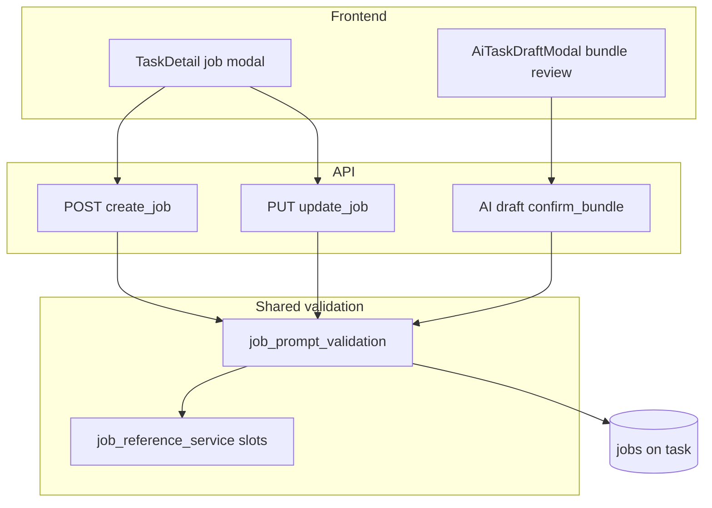

# feat: Videocontent and runway-video job CRUD

## Summary

Add **`purpose: videocontent`** and **`generator: runway-video`** so operators can create, edit, list, and delete video jobs through the existing job API and GUI. Runway options live in **`job.prompt`**: text (`prompt`), **`model`** (fixed enum), and **`reference_id`** (integer slot pointing at an **`imagecontent`** job on the same task). Include **TaskDetail**, **AI task draft** schema/modal, and **strict API validation** on create/update/confirm. **No processor** in this slice — Process remains enabled and will error until a follow-up adds dispatch.

---

## Problem Frame

Image jobs today use `purpose: imagecontent` and generators `dalle` / `gptimage15` / `gptimage2` with a minimal prompt shape `{ "prompt": "..." }`. Per-task **`reference_id` slots** exist on each job row for stable ordering and future cross-job links, but nothing in `prompt` JSON or the UI yet expresses “this video job uses the image from slot N.”

Video generation (Runway) needs a stored contract — generator, model, motion prompt, and upstream image slot — before integration work. The REST layer already accepts free-form `prompt` dicts; without validation and GUI, authors cannot reliably CRUD video jobs or test bundles. Processor dispatch is intentionally deferred so CRUD and authoring surfaces land first.

(see origin: conversation; prior slot work in `docs/plans/2026-06-02-001-feat-job-reference-id-plan.md` R13 deferred prompt resolution)

---

## Requirements

- R1. Operators can create jobs with `purpose: "videocontent"` and `generator: "runway-video"` via `POST /api/v1/tasks/{task_id}/jobs`.
- R2. Operators can update those jobs via `PUT` (generator, purpose, prompt, order, result) with the same validation rules as create.
- R3. Operators can list, view, edit, and delete video jobs in **TaskDetail** with purpose-filtered generator choices and fields for `prompt`, `model`, and **image slot** (`prompt.reference_id`).
- R4. **`prompt` for runway-video** must be a JSON object with required keys: `prompt` (non-empty string), `model` (allowed enum value), `reference_id` (integer ≥ 1).
- R5. On create/update (REST), when `generator` is `runway-video` (case-insensitive), API returns **422** if `reference_id` in prompt does not match any job on the same task with `purpose: "imagecontent"`. No requirement that the referenced job is `processed` or has image `result`.
- R6. On create/update (REST), when `generator` is `runway-video`, API returns **422** if `model` is not in the v1 enum (`gen4_turbo`, `veo3.1_fast`).
- R7. Image jobs (`imagecontent` + image generators) keep today’s prompt shape; switching generator away from `runway-video` does not require `model` / `reference_id` in prompt.
- R8. **AI draft** strict JSON schema and confirm path accept `videocontent`, `runway-video`, and the expanded prompt object; validation matches REST (including cross-slot check against jobs in the **same draft item** at confirm time, and against persisted task jobs on REST).
- R9. **Process** is not implemented for `runway-video`; existing `process_job` behavior (unknown generator error) is acceptable and unchanged in this slice.
- R10. Instagram publish and `instagramImageJobs` preview remain **imagecontent-only**; no videocontent publish path.

---

## Key Technical Decisions

- KTD1. **`prompt.reference_id` (snake_case)** names the image slot inside `prompt`, distinct from the job row’s own `reference_id` column — UI labels must say “Image slot” vs “Job ref” to avoid confusion.
- KTD2. **Fixed model enum** in one backend constant (and mirrored in frontend config); v1 values: `gen4_turbo`, `veo3.1_fast`.
- KTD3. **Shared validation module** `app/services/job_prompt_validation.py` (new) used from REST routes and `AiTaskDraftService._normalize_item` so REST, AI confirm, and future processor share one contract.
- KTD4. **Generator lowercase token** `runway-video` stored as provided; validation compares case-insensitively; future processor branch will use `.lower()` like image generators.
- KTD5. **Purpose-filtered generator UI** — `videocontent` → only `runway-video`; `imagecontent` → dalle / gptimage15 / gptimage2.
- KTD6. **AI draft prompt schema** — use a purpose/generator-aware strict schema (separate `_runway_video_prompt_schema()` or conditional `oneOf` in `_draft_job_schema`) so OpenAI strict mode keeps `additionalProperties: false`.
- KTD7. **No processor changes** in this plan; task advancement when all jobs processed is unchanged (video jobs left unprocessed will block task flow — acceptable until processor slice).

---

## High-Level Technical Design

**Prompt contract (runway-video):**

| Key | Type | Rule |
|-----|------|------|
| `prompt` | string | Required, non-empty after strip |
| `model` | string | Required; ∈ {`gen4_turbo`, `veo3.1_fast`} |
| `reference_id` | int | Required; ≥ 1; must match an `imagecontent` job on same task |

---

## Scope Boundaries

**In scope**

- `job_prompt_validation` service + REST hooks in `create_job` / `update_job`
- `JobCreate` / `JobUpdate` / `AiDraftJob` integration with validation (422 / `AiTaskDraftItemValidationError`)
- `ai_draft_response_schema.py` enum and prompt shape updates
- `TaskDetail.vue`, `AiTaskDraftModal.vue`, optional `frontend/src/components/jobGeneratorConfig.js`
- API and service tests; schema regression tests
- Glossary / runtime-flows notes for videocontent and prompt.reference_id

**Deferred to follow-up work**

- `processor_runway_video.py` and `process_job` branch
- Worker ordering, mixed image+video “all jobs processed” policy
- Publish path for videocontent / carousel including video
- Requiring referenced image job to be `processed` with usable `result`
- `ce-compound` solution doc after processor lands

**Outside this change**

- Runway API credentials, FTP/video storage layout
- JSON import (`TaskList`) beyond what existing generic job create already sends

---

## Implementation Units

### U1. Prompt contract constants and validation service

**Goal:** Single source of truth for runway-video prompt shape and cross-slot checks.

**Requirements:** R4, R5, R6, KTD2, KTD3

**Dependencies:** None

**Files:**

- Create: `app/services/job_prompt_validation.py`
- Create: `tests/services/test_job_prompt_validation.py`

**Approach:**

- Define `RUNWAY_VIDEO_GENERATOR = "runway-video"`, `VIDEOCONTENT_PURPOSE = "videocontent"`, `RUNWAY_VIDEO_MODELS = ("gen4_turbo", "veo3.1_fast")`.
- Raise `JobPromptValidationError` (subclass of `ValueError` with `field` for 422 `loc`) for invalid prompt keys, empty prompt text, bad model, missing/invalid `reference_id`.
- `validate_runway_video_prompt(prompt: dict | None) -> dict` — returns normalized prompt dict.
- `validate_image_slot_reference(session, task_id, slot: int) -> None` — query `Job` where `task_id`, `reference_id == slot`, `purpose == "imagecontent"`; 422 if none.
- `validate_job_prompt_for_write(session, task_id, *, generator: str, purpose: str | None, prompt: dict | None) -> dict | None` — no-op for non-runway generators; full validation for runway-video (require `purpose == videocontent` optionally — recommend 422 if purpose mismatch when generator is runway-video).

**Patterns to follow:** `app/services/job_reference_service.py` (`JobReferenceValidationError`, field-aware errors)

**Test scenarios:**

- Happy path: valid prompt dict returned unchanged (normalized strip on `prompt` text).
- Edge: `prompt` missing or empty string → error, field `prompt`.
- Edge: `model` not in enum → error, field `prompt.model`.
- Edge: `reference_id` 0 or missing → error, field `prompt.reference_id`.
- Error: slot 3 on task with only imagecontent ref 1 and 2 → error.
- Happy path: slot 1 exists with purpose `imagecontent` → passes.
- Error: slot 1 exists but purpose `videocontent` → fails.
- Edge: non-runway generator with extra keys in prompt → ignored by runway validator (pass through).

**Verification:** Service tests green; no route changes yet.

---

### U2. REST job create/update validation

**Goal:** Persist video jobs only when prompt and image slot are valid.

**Requirements:** R1, R2, R5, R6, R7

**Dependencies:** U1

**Files:**

- Modify: `app/api/routes.py` (`create_job`, `update_job`)
- Modify: `app/api/schemas.py` (extend `Field` descriptions for generator/purpose examples)
- Create: `tests/api/test_runway_video_job_routes.py`

**Approach:**

- After task exists, before commit: call `validate_job_prompt_for_write` with merged generator/purpose/prompt (on update, use incoming values or fall back to existing job fields for partial PUT).
- Map `JobPromptValidationError` to HTTP 422 with `loc: ["body", field]` (same shape as `JobReferenceValidationError`).
- Do not touch `process_job` route.

**Patterns to follow:** `tests/api/test_job_reference_id_routes.py` (`_headers`, `_create_task`, assert 422 body)

**Test scenarios:**

- Happy path: create imagecontent job ref 1, then create runway-video videocontent job with `prompt: { prompt, model, reference_id: 1 }` → 201.
- Error: runway-video without imagecontent ref on task → 422.
- Error: invalid model → 422.
- Happy path: PUT updates `model` and `reference_id` with valid slot.
- Error: PUT sets `reference_id` to slot used by videocontent job only → 422.
- Happy path: dalle job still accepts `{ "prompt": "x" }` only.

**Verification:** New API tests pass; existing reference_id route tests unchanged.

---

### U3. AI draft schema and service normalization

**Goal:** LLM and confirm path can author videocontent / runway-video jobs with strict schema parity.

**Requirements:** R8, R4, R5, R6

**Dependencies:** U1

**Files:**

- Modify: `app/services/integrations/ai_draft_response_schema.py`
- Modify: `app/services/ai_task_draft_service.py` (`_normalize_item` / job normalization)
- Modify: `tests/services/integrations/test_ai_draft_response_schema.py`
- Modify: `tests/services/test_ai_task_draft_service.py`

**Approach:**

- Add `videocontent` to `_AI_DRAFT_JOB_PURPOSE`; add `runway-video` to `_AI_DRAFT_JOB_GENERATORS`.
- Replace or branch `_job_prompt_schema()` — for runway jobs use object with `prompt`, `model` (enum), `reference_id` (integer, minimum 1); keep image-only schema for image generators (use `oneOf` on job object keyed by `generator`, or separate item schemas merged in `_draft_job_schema` — pick the pattern that satisfies OpenAI strict mode and existing schema tests).
- In `_normalize_item`, after pydantic parse, call shared `validate_job_prompt_for_write` with a session and **draft task id** only on confirm — for preview-only normalization without DB task, validate prompt shape only; on confirm, `create_task_bundle_with_jobs` has `task.id` — validate slots against jobs in the bundle being created plus any existing jobs on that task if confirm reuses task (confirm always creates new tasks in bundle flow — validate refs against **jobs listed in the same item** before persist, and any job already on task if applicable).

**Clarification for implementer:** On AI draft confirm, each item creates a **new** task. Cross-reference validation should ensure `prompt.reference_id` matches an **imagecontent** job in the **same item’s `jobs` list** (by explicit `reference_id` on draft jobs pre-assignment). REST create validates against DB rows on the task.

**Patterns to follow:** `docs/solutions/architecture-patterns/ai-draft-backend-prompt-wiring-2026-05-22.md` (single gate, strict schema)

**Test scenarios:**

- Schema test: bundle schema includes `runway-video` and `videocontent` enums.
- Schema test: runway prompt object requires all three keys.
- Service test: preview bundle with one imagecontent + one runway job referencing slot 1 → normalizes.
- Error: runway job references slot 2 but only slot 1 imagecontent in item → `AiTaskDraftItemValidationError`.
- Happy path: confirm bundle creates both jobs with expected prompt JSON persisted.

**Verification:** AI draft service and schema tests pass.

---

### U4. TaskDetail job modal and table

**Goal:** Operators manage video jobs from task detail without raw JSON editing.

**Requirements:** R3, R7, KTD5

**Dependencies:** U2 (API ready)

**Files:**

- Modify: `frontend/src/components/TaskDetail.vue`
- Create (optional): `frontend/src/components/jobGeneratorConfig.js`

**Approach:**

- Centralize purpose/generator/model lists in `jobGeneratorConfig.js` (purposes, generatorsByPurpose, runwayModels, defaultNewJob per purpose).
- Purpose change resets generator to first allowed option.
- When `runway-video`: show model `<select>`, image slot `<select>` (options from `task.jobs` filtered `purpose === 'imagecontent'`, label `Ref {id} — {generator}`), prompt textarea.
- `submitJob` builds `prompt: { prompt, model, reference_id }`; `editJob` hydrates fields from `job.prompt`.
- Prompt column: for runway jobs show `model` and `→ ref N` alongside truncated text.
- Do not disable Process button (R9 / user decision).
- Keep `instagramImageJobs` filter unchanged.

**Patterns to follow:** `docs/plans/2026-05-04-001-feat-gptimage2-image-generator-plan.md` (generator options); existing modal `submitJob` payload pattern

**Test scenarios:**

- Test expectation: none — Vue SFC; manual QA checklist: create video job, reload, edit model/ref, delete.

**Verification:** Manual create/edit/delete round-trip against API; purpose switch clears invalid generator.

---

### U5. AiTaskDraftModal bundle editor

**Goal:** Draft review/confirm supports mixed image + video jobs.

**Requirements:** R8, R3, KTD5

**Dependencies:** U3, U4 (shared config optional)

**Files:**

- Modify: `frontend/src/components/AiTaskDraftModal.vue`
- Modify: `frontend/src/components/jobGeneratorConfig.js` (if created in U4)

**Approach:**

- Import shared config; extend `emptyDraftJob()` defaults.
- Purpose `<select>` with `imagecontent` and `videocontent` (replace free-text purpose for consistency).
- Generator filtered by purpose; runway fields mirror TaskDetail (model select, reference slot select from **sibling jobs in the same draft item**).
- Update confirm gate (~L684): runway jobs require `prompt`, `model`, and `reference_id`; image jobs require `prompt.prompt` only.
- When adding a job to an item, image slot dropdown lists imagecontent jobs in that item only.

**Patterns to follow:** U4 TaskDetail; existing `emptyDraftJob` / `ai-draft-job-grid`

**Test scenarios:**

- Test expectation: none — manual QA: preview bundle with 1 image + 1 video job, confirm creates tasks.

**Verification:** Confirm succeeds in dev against stub/real adapter; validation errors surface in UI from API.

---

### U6. Documentation

**Goal:** Future readers understand videocontent vs imagecontent and prompt.reference_id semantics.

**Requirements:** R10 (document exclusion)

**Dependencies:** U2

**Files:**

- Modify: `docs/glossary.md`
- Modify: `docs/runtime-flows.md`

**Approach:**

- Glossary entries: `videocontent`, `runway-video`, `prompt.reference_id` vs job `reference_id`.
- Runtime flows: TaskDetail job modal fields; note processor not wired.

**Test scenarios:**

- Test expectation: none — docs only.

**Verification:** Links and terms match implemented behavior.

---

## Risks and Dependencies

| Risk | Mitigation |
|------|------------|
| Two meanings of `reference_id` confuse operators | Consistent UI labels; glossary |
| AI strict schema rejects valid bundles | Extend schema tests before enabling draft enums |
| Unprocessed video jobs block task completion when mixed with images | Document; processor slice addresses behavior |
| Draft item confirm validates refs only within item | Document in U3; author must place image job in same item before video job |

**Prerequisites:** None (builds on deployed `jobs.reference_id` column).

---

## Open Questions

- **OQ1 (non-blocking):** Extend model enum beyond `gen4_turbo` and `veo3.1_fast` — add constants in one place when product confirms names.
- **OQ2 (deferred):** Should `purpose: videocontent` with non-runway generator be rejected at API? Recommend yes (422) in U1 for consistency.

---

## Sources and Research

- Conversation brainstorm (2026-06-04) and user AskQuestion decisions
- `docs/plans/2026-06-02-001-feat-job-reference-id-plan.md`
- `docs/plans/2026-05-04-001-feat-gptimage2-image-generator-plan.md`
- `docs/solutions/architecture-patterns/job-reference-id-per-task-slots.md`
- `docs/solutions/architecture-patterns/ai-draft-backend-prompt-wiring-2026-05-22.md`
- Repo research: job CRUD in `app/api/routes.py`, GUI in `TaskDetail.vue` / `AiTaskDraftModal.vue`
