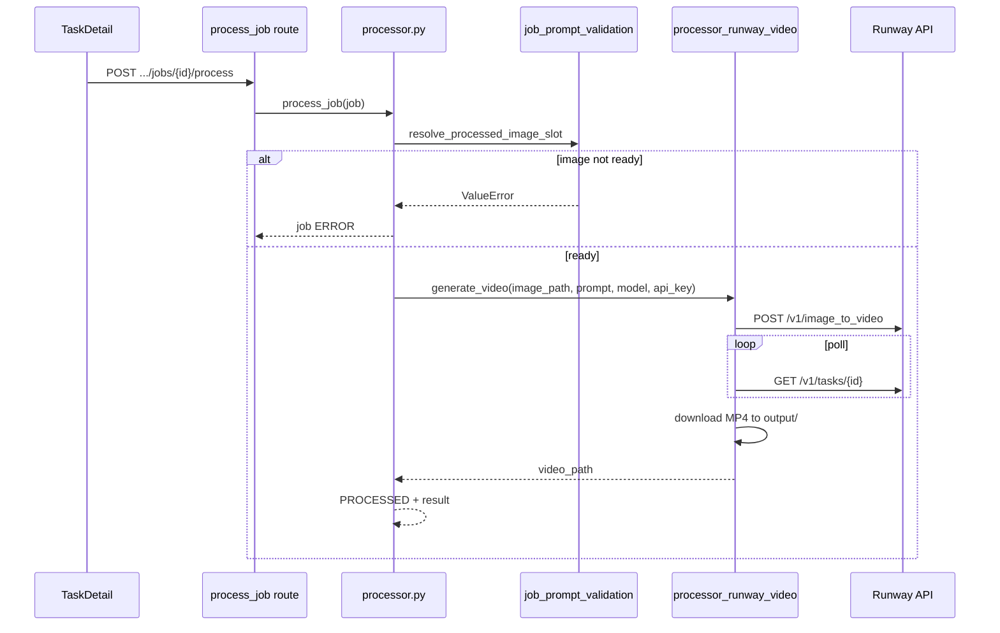

# feat: Runway video job processor

## Summary

Wire **`runway-video`** job processing end-to-end: resolve the referenced **`imagecontent`** slot at process time, call Runway image-to-video, save a local MP4 under `output/`, persist **`job.result`**, disable **Process** in TaskDetail until the image slot is ready, and show a playable video preview. Runway credentials resolve **tenant env first**, then global config. Manual image-then-video ordering; no publish or worker dependency changes. (see origin: `docs/brainstorms/2026-06-14-runway-video-processor-requirements.md`)

---

## Problem Frame

Videocontent CRUD is shipped — operators can author `videocontent` / `runway-video` jobs with validated `prompt`, `model`, and `prompt.reference_id`. Tasks have been created but not run. **`process_job`** still raises **unknown generator** for `runway-video`, so mixed image+video tasks cannot reach `PENDING_CONFIRMATION`.

This slice closes authoring → generation → preview without touching Instagram publish or worker ordering.

---

## Requirements

Traceability to origin brainstorm R-IDs:

**Processing and dispatch**
- R1. Dispatch `runway-video` in `process_job` (origin R1).
- R2. Read normalized prompt: motion text, model enum, image slot (origin R2).
- R3–R4. Resolve sibling `imagecontent` job by row `reference_id`; fail if missing, not `PROCESSED`, or no usable `image_path` (origin R3, R4).
- R5–R7. Success `result` with `video_path` + optional `public_url`; error → `ERROR`; task advances when all jobs `PROCESSED` (origin R5–R7).

**Runway integration**
- R8–R10. Tenant-first `RUNWAY_API_KEY` with global fallback; fail closed if unset; adapter completes async Runway task within one process invocation (origin R8–R10).

**Operator UI**
- R11–R14. Disable Process with reason until image slot ready; video preview for processed jobs; retry unchanged (origin R11–R14).

**Explicit non-goals**
- R15–R17. No publish, no worker ordering, no CRUD-time processed-image requirement (origin R15–R17).

---

## Key Technical Decisions

- **KTD1. Official Runway REST API (no SDK)** — Use `requests` against Runway's task API: `POST /v1/image_to_video` → poll `GET /v1/tasks/{id}` until terminal state. Base URL `https://api.dev.runwayml.com/v1`, header `X-Runway-Version: 2024-11-06`, auth `Authorization: Bearer <key>`. Both stored models map to **`POST /v1/image_to_video`** (`gen4_turbo` image-required; `veo3.1_fast` supports image+text). (see external: Runway API reference / dev docs)

- **KTD2. Local image as data URI** — Referenced image is already on disk at `result.image_path`. Encode as `data:image/jpeg;base64,...` for `promptImage` rather than requiring a public HTTPS URL or a separate Runway upload step in v1.

- **KTD3. Shared process-time slot helper** — Add `resolve_processed_image_slot(session, task_id, slot) -> Job` (or equivalent) in `app/services/job_prompt_validation.py` returning the sibling job and validated local path. CRUD helper `validate_image_slot_reference` stays existence-only. Processor and future callers share one readiness definition.

- **KTD4. Adapter boundary** — `processor_runway_video.generate_video(...)` accepts explicit inputs: local image path, motion prompt, model, task_id, job_id, api_key. No DB/session inside the adapter (mirror `processor_gptimage2.py`).

- **KTD5. Credential resolution at call time** — `resolve_runway_api_key(*, tenant_env: dict | None) -> str` checks `tenant_env.get("RUNWAY_API_KEY")` then `os.getenv("RUNWAY_API_KEY")` / `app.config.RUNWAY_API_KEY`. Do not rely on import-time config alone (tenant overlay is per-request). Mirror precedence in `publisher_instagram.py` (see `docs/decisions/003-explicit-tenant-config-resolution.md`).

- **KTD6. Output naming** — Save as `output/{task_id}/{job_id}.mp4`; store web-relative `video_path: "/output/{task_id}/{job_id}.mp4"`. Reuse `public_url_for_image_path()` for `public_url` (path-agnostic join).

- **KTD7. Result payload** — Success: `{ video_path, public_url?, generator, runway_task_id? }`. Optionally retain short-lived Runway output URL as `runway_url` for debugging (not required for preview). Failure: existing `{ error }` traceback pattern.

- **KTD8. UI parity helper** — Extend `frontend/src/components/jobGeneratorConfig.js` with `runwayImageSlotProcessed(job, siblingJobs)` mirroring backend readiness (slot exists, status `processed`, usable image result). TaskDetail disables Process when false and shows slot-specific reason (origin AE1).

- **KTD9. v1 generation parameters** — Fixed defaults in adapter constants: `ratio: "1280:720"`, `duration: 5` (within Runway allowed ranges). Not exposed in job prompt in v1.

- **KTD10. Timeout config** — Add `RUNWAY_VIDEO_TIMEOUT_SECONDS` (default 600) for submit + poll loop; separate from `GPT_IMAGE_TIMEOUT_SECONDS`.

---

## High-Level Technical Design

**Runway request shape (directional):**

| Field | Source |
|-------|--------|
| `model` | `job.prompt.model` |
| `promptText` | `job.prompt.prompt` |
| `promptImage` | data URI from referenced job `result.image_path` |
| `ratio` | adapter default `1280:720` |
| `duration` | adapter default `5` |

---

## Scope Boundaries

**In scope**

- Process-time image slot resolution helper
- `processor_runway_video.py` + `process_job` branch
- Global `RUNWAY_API_KEY` in `app/config.py`
- Service + API process tests
- TaskDetail Process disable + video preview
- `docs/runtime-flows.md` update

**Deferred to follow-up work**

- Instagram / videocontent publish
- Worker dependency-aware job picking
- CRUD-time requirement that image slot is processed
- Exposing `ratio` / `duration` in job prompt or UI
- Runway SDK or `runway://` upload URI flow (use data URI in v1)
- `ce-compound` solution doc after processor lands
- Renaming `public_url_for_image_path` to a neutral name

**Outside this change**

- Changes to runway prompt JSON contract at CRUD
- FTP / off-host video storage
- Automated pipeline without operator Process clicks

---

## Risks and Dependencies

| Risk | Mitigation |
|------|------------|
| Long Runway poll blocks worker/API thread | Configurable timeout; document expected wait; same pattern as slow image gens today |
| Worker picks runway job before image if both READY | Backend fail-closed (R4); UI disable (R11); document manual ordering |
| Runway output URLs expire in 24–48h | Download immediately to local MP4 (KTD6) |
| Tenant API key not visible to import-time config | Call-time resolver (KTD5) |
| `/output` MIME for `.mp4` | Verify StaticFiles serves video; Nginx already aliases `/output` |

**Prerequisites:** Valid Runway API key in tenant env or server `.env` for manual E2E verification.

---

## Implementation Units

### U1. Process-time image slot resolution

**Goal:** Single backend definition of “image slot ready for Runway.”

**Requirements:** Origin R3, R4; F2; AE1

**Dependencies:** None

**Files:**

- Modify: `app/services/job_prompt_validation.py`
- Modify: `tests/services/test_job_prompt_validation.py`

**Approach:**

- Add helper (name at implementer's discretion) that queries `Job` where `task_id`, `reference_id == slot`, `purpose == imagecontent`.
- Require `status == PROCESSED` and non-empty `result.image_path` (or `image_path_relative`).
- Raise `ValueError` with clear message naming the slot and reason (missing / not processed / no path).
- Return the matched job and normalized filesystem path for the adapter (resolve relative `/output/...` against `OUTPUT_DIR` if needed).

**Patterns to follow:** Existing `validate_image_slot_reference`; `JobStatus` enum in `app/models/job.py`

**Test scenarios:**

- Happy path: processed imagecontent job with `image_path` → returns job + path.
- Error: slot exists but job `READY` → ValueError mentions not processed.
- Error: slot exists but empty `result` → ValueError mentions no image path.
- Error: no imagecontent job at slot → ValueError.

**Verification:** Service tests green; CRUD validation unchanged.

---

### U2. Runway config and credential resolver

**Goal:** Fail-closed API key resolution for tenant and global contexts.

**Requirements:** Origin R8, R9; F3; AE4

**Dependencies:** None

**Files:**

- Modify: `app/config.py`
- Create: `app/services/integrations/runway_config.py` (or place in adapter module if tiny)
- Create: `tests/services/integrations/test_runway_config.py`

**Approach:**

- Add `RUNWAY_API_KEY = os.getenv("RUNWAY_API_KEY")` and `RUNWAY_VIDEO_TIMEOUT_SECONDS` (default 600).
- Expose `resolve_runway_api_key(tenant_env=None) -> str` with tenant-first, global fallback.
- Raise `ValueError` with setup hint when missing (no HTTP call).

**Patterns to follow:** `publisher_instagram.py` tenant env precedence; fail-closed messages in image processors

**Test scenarios:**

- Tenant env key present → returned.
- Tenant missing, global set → global returned.
- Neither set → ValueError, message mentions tenant env and `.env`.

**Verification:** Unit tests pass.

---

### U3. Runway video adapter

**Goal:** Image-to-video generation and local MP4 save with no DB access.

**Requirements:** Origin R2, R10; KTD1, KTD2, KTD4, KTD6, KTD9, KTD10

**Dependencies:** U2

**Files:**

- Create: `app/services/jobs/processor_runway_video.py`
- Create: `tests/services/test_processor_runway_video.py`

**Approach:**

- `generate_video(*, image_path, prompt_text, model, task_id, job_id, api_key, timeout_seconds) -> dict` returning `{ video_path, runway_task_id?, runway_url? }`.
- Read local image file; build data URI for `promptImage`.
- POST `https://api.dev.runwayml.com/v1/image_to_video` with version header.
- Poll `GET /v1/tasks/{id}` with backoff (e.g. 5s) until `SUCCEEDED` or `FAILED` or timeout.
- On success, download first output URL to `OUTPUT_DIR / task_id / f"{job_id}.mp4"`.
- Redact `Authorization` in logs; do not log full API responses that may contain secrets.

**Execution note:** Mock `requests` in unit tests; no live Runway calls in CI.

**Patterns to follow:** `app/services/jobs/processor_gptimage2.py` (HTTP, file write, error wrapping)

**Test scenarios:**

- Happy path: mock submit + poll SUCCEEDED + download → returns `/output/{task_id}/{job_id}.mp4`.
- Error: poll returns FAILED → RuntimeError.
- Error: timeout while polling → RuntimeError.
- Error: missing api_key passed in → ValueError before HTTP.
- Edge: non-200 submit → RuntimeError with status, no secret in logged headers.

**Verification:** Adapter tests pass with mocked HTTP.

---

### U4. Processor dispatch and orchestration

**Goal:** Integrate runway branch into existing job processing flow.

**Requirements:** Origin R1, R5–R7; F1; AE2, AE3

**Dependencies:** U1, U3

**Files:**

- Modify: `app/services/jobs/processor.py`
- Create: `tests/services/test_runway_video_job_processor.py`
- Modify: `tests/api/test_runway_video_job_routes.py`

**Approach:**

- Add `elif generator_type == "runway-video":` branch after image generators.
- Load tenant via `get_tenant()` for credential resolution (worker and API both initialize context).
- Call U1 helper with `prompt.reference_id` from normalized prompt.
- Call adapter; set `result` with `video_path`, `public_url` via `public_url_for_image_path`, `generator: "runway-video"`.
- Preserve existing task completion logic when all jobs `PROCESSED`.

**Patterns to follow:** `tests/services/test_image_job_processor.py`; existing dalle/gptimage branches in `processor.py`

**Test scenarios:**

- Covers AE2. Happy path: mock adapter → job `PROCESSED`, `result.video_path` set, `public_url` when `PUBLIC_URL` set.
- Covers AE1. Image not processed → ValueError, job `ERROR`, adapter not called.
- Covers AE4. No API key → ValueError, job `ERROR`, adapter not called.
- Covers AE3. Mixed task: after runway success, task → `PENDING_CONFIRMATION`.
- Error: adapter raises → job `ERROR`, exception re-raised.
- API: POST process on ready runway job with mocks → 200 and updated job body.

**Verification:** New service + API tests pass; existing image processor tests unchanged.

---

### U5. TaskDetail Process gate and video preview

**Goal:** UI reflects backend readiness; operators see playable video after success.

**Requirements:** Origin R11–R14; F1, F2; AE1, AE2

**Dependencies:** U1 (behavior contract; frontend mirrors logic)

**Files:**

- Modify: `frontend/src/components/jobGeneratorConfig.js`
- Modify: `frontend/src/components/TaskDetail.vue`

**Approach:**

- Add `runwayImageSlotProcessed(job, siblingJobs)` and `runwayProcessBlockedReason(job, siblingJobs)` using same rules as backend (existence, `processed`, image path in result).
- Process button: add `:disabled` when `isRunwayJob(job) && !runwayImageSlotProcessed(...)` (still respect `processingJobs`).
- Show muted helper text near Process when disabled (e.g. “Process image slot 1 first”).
- Add `getJobVideoUrl(result)` parallel to `getJobImageUrl`; use `<video controls>` in jobs table and/or edit modal for processed runway jobs.
- Prompt column: optionally show truncated motion prompt + model for runway rows (existing pattern).

**Patterns to follow:** `getJobImageUrl`, image thumb + modal; `runwayImageSlotValid` in `jobGeneratorConfig.js`

**Test scenarios:**

- Test expectation: none — Vue SFC; manual QA: disabled Process before image processed, enabled after, video plays after process.

**Verification:** Manual round-trip against API with mocked or real Runway key in dev.

---

### U6. Documentation

**Goal:** Runtime flows reflect runway processing.

**Requirements:** Success criteria traceability

**Dependencies:** U4, U5

**Files:**

- Modify: `docs/runtime-flows.md`
- Modify: `docs/glossary.md` (processor wired note for `videocontent` / `runway-video`)

**Approach:**

- Document process flow: image first (manual), runway dispatch, output path, credential keys, UI disable behavior.
- Note worker FIFO unchanged and publish still image-only.

**Test scenarios:**

- Test expectation: none — docs only.

**Verification:** Terms match implemented behavior.

---

## Open Questions

### Deferred to implementation

- Confirm exact Runway task status strings and failure payload shape against live API responses.
- Whether Nginx/static serving needs explicit `Content-Type` for `.mp4` in this deployment (likely fine via file extension).
- Default `duration` / `ratio` — start with 5s and 1280:720; adjust if product prefers square 1024:1024 to match image gens.

---

## Sources and Research

- Origin: `docs/brainstorms/2026-06-14-runway-video-processor-requirements.md`
- CRUD pattern: `docs/solutions/architecture-patterns/videocontent-runway-video-job-crud.md`
- Processor pattern: `docs/plans/2026-05-04-001-feat-gptimage2-image-generator-plan.md`
- Runway API: `POST /v1/image_to_video`, poll `GET /v1/tasks/{id}` (Runway dev API docs / official API reference, 2024-11-06 version header)
- Tenant config direction: `docs/decisions/003-explicit-tenant-config-resolution.md`
